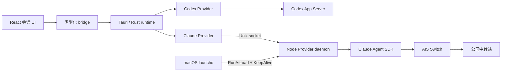

# Claude Provider 接入技术设计

状态：一期 Provider daemon 已实现并通过 AIS 断线重连验证

最后更新：2026-09-01

Source of truth：本文档

## 结论

Codex Harness 将 Claude Code 作为原生会话 Provider 接入。Claude Agent SDK 负责会话、上下文、agent loop、工具和权限回调；独立常驻的 Node Provider daemon 负责 SDK 生命周期并把输入输出转换成精简的 Harness Provider Protocol；Rust 通过 Unix socket 连接或启动 daemon，并负责 Tauri IPC、安全边界和本地会话索引；React 只消费类型化的通用会话能力。

Provider daemon 不归属于 Harness 窗口或 WebView，而是由 macOS launchd 通过 per-user LaunchAgent 管理。用户登录后 daemon 自动启动，异常退出后由 launchd 重新拉起；关闭 Harness 不会停止 daemon 或 active query。新 Harness 进程连接同一个 per-user socket，通过事件序号回放恢复 daemon 生命周期内的消息、工具和审批状态。原 foreground SDK adapter 仅作为实验参考保留，不再进入生产 runtime。

Claude Code Supervisor 已能托管脱离终端的后台 session，但 Agent View 仍标记为 research preview。公开机器接口覆盖后台启动、状态、日志、停止和重新 attach，未覆盖结构化消息流、工具事件和审批响应。本阶段不以 TUI、私有 socket 或内部状态文件作为 Provider 协议，因此暂不替换为 Supervisor-only 实现。

一期先验证 AIS Switch 能否让 Claude Agent SDK 经公司中转站完成请求。验证通过后，仅实现创建会话、文本与图片输入、流式回答、基础工具活动、审批、停止和按 session ID 恢复。Provider 未声明的能力不在界面展示。

不把 Claude SDK 事件伪装成完整 Codex App Server JSON-RPC。Codex 与 Claude 分别适配到 Harness 自有的最小协议，避免把 Codex 的 thread、turn、item 语义固化为其他 Provider 的实现要求。

## 背景与目标

公司将部分 Agent 预算从 Codex 转移到由 AIS Switch 提供的 Claude Code 额度。AIS Switch 会配置 Claude Code 使用本机中转地址和公司提供的模型。Harness 需要允许用户在新会话中选择 Codex 或 Claude，让任务直接消耗对应 Provider 的额度。

当前 Harness 以 Codex App Server 为唯一 runtime：

- [`app_server.rs`](../src-tauri/src/app_server.rs) 管理共享 daemon、Unix socket/WebSocket 和 JSON-RPC。
- [`appServerClient.ts`](../src/core/runtime/appServerClient.ts) 暴露 Codex `thread/*`、`turn/*` 等方法。
- [`codex.ts`](../src/core/domain/codex.ts) 的会话领域类型沿用 App Server thread、turn、item 结构。
- [`useHarness.ts`](../src/features/conversation/useHarness.ts) 同时承担会话目录、生命周期、事件处理和输入发送。
- [`bridge.ts`](../src/core/runtime/bridge.ts) 是 React 调用 Tauri 原生能力的唯一入口。

### 目标

| 目标 | 验收标准 |
| --- | --- |
| 验证 AIS Switch | 官方 Claude Agent SDK 能通过现有 AIS 配置完成最小请求，且不读取、输出或持久化 token |
| 原生 Claude 会话 | 用户能创建、继续、停止和恢复 Claude 会话 |
| 基础做事能力 | 能展示文本、图片输入、文件读写和命令工具活动，并处理需要人工确认的调用 |
| Provider 隔离 | Claude 不直接调用 Codex App Server；React 不直接调用 Claude SDK 或子进程 |
| 渐进兼容 | Codex 现有功能和历史不迁移；Claude 未实现的功能按 capability 隐藏 |
| 可升级 | Claude SDK 升级集中在 Node sidecar；Harness Provider Protocol 保持小而稳定 |

### 非目标

- 一期不实现 Codex 与 Claude 会话正文互相迁移。
- 一期不保证 Codex 所有 thread、turn、queue、steer、fork、Skills、MCP 和用量功能在 Claude 上等价。
- 一期不接入 Claude 子 Agent 活动树或 Quick Agent Job。
- 一期不把会话正文、凭据或 token 写入 `state.sqlite`。
- 一期不内置公司中转协议，也不绕过 AIS Switch 直接管理公司凭据。

## 核心设计

### 总体架构



Rust 是统一的宿主和安全边界。Node Provider daemon 只承载 Claude Agent SDK，不提供任意 shell 接口，不访问 Harness SQLite。SDK 继承经过筛选的真实用户环境，并显式使用已解析的 Claude executable 和工作目录。socket 位于 `~/.codex-harness/claude-provider.sock`，目录权限为 `0700`，socket 权限为 `0600`。

### 进程管理与开机自启动

macOS 上使用 label 为 `com.local.codex-harness.claude-provider` 的 per-user LaunchAgent。这里的“开机自启动”准确含义是用户登录图形会话后启动，不安装需要 root 权限的 system daemon：

- Harness 首次运行时把当前版本的 `daemon.mjs` 和固定 SDK 复制到 `~/.codex-harness/claude-provider/`，不让 LaunchAgent 依赖 App bundle 的可变安装路径。
- LaunchAgent plist 写入 `~/Library/LaunchAgents/`，声明 `RunAtLoad=true`、`KeepAlive=true`、后台进程类型和 10 秒重启节流。
- plist 只保存 executable、socket、工作目录和 PATH 等非敏感路径，不写入 AIS token、Anthropic API key 或其他凭据；LaunchAgent 通过 `/usr/bin/env -i` 启动，daemon 在加载 SDK 前再次删除非白名单环境变量，AIS 配置继续由 Claude user settings 提供。
- Harness 启动时更新本地 runtime 文件和 plist。若服务已经由 launchd 加载，只执行非破坏性的 `kickstart`，不会重启正在工作的 daemon。
- 从旧版按需 daemon 升级时，如果 socket 已被现有 daemon 占用，不中断 active turn；LaunchAgent 已安装但延后到下一次用户登录接管。
- Rust 连接失败时优先请 launchd 拉起服务；仅在 LaunchAgent 安装或加载不可用时，才使用原来的 detached process 作为兼容兜底。

### Harness Provider Protocol

一期协议只覆盖已承诺的能力。

#### 请求

| 方法 | 关键字段 | 说明 |
| --- | --- | --- |
| `initialize` | protocol version、last event sequence | daemon 握手、实例标识、当前 runtime 快照和断点事件回放 |
| `runtime/status` | 无 | 返回 daemon 实例、最新事件序号、active turns 和当前 pending approvals |
| `turn/start` | session ID、provider session ID、`cwd`、结构化输入 | 首次发送时创建 SDK 会话；后续使用 `resume` 恢复并开始工作 |
| `turn/interrupt` | session ID | 通过 SDK cancellation 中断当前 query |
| `approval/respond` | request ID、allow/deny | 恢复 `canUseTool` 回调 |
| `shutdown` | 无 | 仅用于测试或显式维护；Harness 退出时不调用 |

#### 事件

| 事件 | 来源 | UI 行为 |
| --- | --- | --- |
| `session/started` | SDK init/result 的 session ID | 建立本地 provider session 索引 |
| `turn/started` | daemon | 会话进入 working |
| `message/user` | daemon | 使用稳定 item ID 重建用户输入 |
| `message/delta` | SDK stream event | 增量显示回答 |
| `message/completed` | SDK assistant message | 固化 assistant message |
| `tool/started` | SDK tool use block | 展示基础工具活动 |
| `tool/completed` | SDK tool result | 更新工具结果和状态 |
| `approval/requested` | SDK `canUseTool` | 进入 Harness 审批流 |
| `approval/resolved` | `approval/respond` | 从所有客户端移除已处理审批 |
| `approval/expired` | SDK cancellation 或 turn 结束 | 从所有客户端移除失效审批 |
| `turn/completed` | SDK result | 结束 working，记录用量摘要（若有） |
| `turn/failed` | SDK error/result | 展示可操作错误，不保存凭据或完整响应头 |

协议在 per-user Unix socket 上使用 JSONL，并包含自增 request ID、provider session ID、turn ID 和 daemon 事件序号。daemon 在内存中保留最近 5,000 个事件；客户端用 `lastEventSeq` 只补收断线后的事件。`initialize` 和 `runtime/status` 同时返回 `daemonInstanceId`、`snapshotSeq`、active turns 与权威 pending approval 快照；初始化回放事件标记为 `replayed`，不能把历史 `approval/requested` 直接当作当前审批。daemon stdout/stderr 只写本地诊断日志，不记录环境变量值。

### Provider capability

会话携带 `provider`，统一会话 hook 集中派生 capability。组件根据 capability 决定是否显示入口；一期实现暂在 `useUnifiedHarness` 和 App shell 两处完成 Provider 路由，后续 Provider 增多前再抽取为独立 registry。

```ts
type ConversationProviderId = 'codex' | 'claude'

interface ConversationCapabilities {
  images: boolean
  approvals: boolean
  interrupt: boolean
  resume: boolean
  queue: boolean
  steer: boolean
  fork: boolean
  skills: boolean
  mcpManagement: boolean
}
```

一期 Claude 默认启用 `images`、`approvals`、`interrupt` 和 `resume`；其他能力关闭。Codex capability 由现有能力映射。

### Node Provider daemon

Node Provider daemon 使用官方 `@anthropic-ai/claude-agent-sdk` 的 streaming input 模式：

- `query()` 接收 `AsyncIterable<SDKUserMessage>`，支持多轮输入和图片。
- `canUseTool` 把工具审批转换成 `approval/requested`，等待 Rust 转发用户决定。
- `AbortController` 处理停止。
- 从 init/result 事件捕获 session ID；进程重启后使用 `resume` 恢复。
- `pathToClaudeCodeExecutable` 指向 Harness 解析出的真实 Claude Code，避免 Universal App 捆绑单架构 Claude binary。
- `env` 以白名单方式继承 `HOME`、`PATH`、`CLAUDE_CONFIG_DIR` 以及 AIS/Claude 所需变量。日志不得包含变量值。
- `settingSources` 启用 user、project 与 local 配置，使 AIS 和项目 `CLAUDE.md` 正常生效。
- `maxTurns` 使用 `65_536` 作为极高的安全上限，避免正常长任务被过早截断，同时保留异常 agent loop 的最终熔断。
- 多个 Harness 客户端可连接同一 daemon；客户端断开不触发 query cancellation。
- daemon 对同一个 Harness session 强制单 active turn，并集中持有 pending approvals；审批处理和失效会广播给所有客户端。
- daemon 异常退出后由 launchd 自动重新启动；已退出进程中的 active query 无法恢复。

一期要求本机 Node.js 18+，并把 daemon、保留的 foreground adapter 与固定版本 SDK 作为 Tauri resource 打包；已验证 SDK resource 脱离仓库 `node_modules` 后仍能工作。正式发布前仍需决定是否把 Node runtime 固定为随 App 发布的双架构产物，并验证 Universal App 在 Apple Silicon 和 Intel Mac 上均能启动。

### Rust Claude runtime

新增独立模块管理 Claude，不修改 `app_server.rs` 的唯一 Codex 协议职责：

- 解析 Node、daemon 和 Claude executable。
- 从真实用户环境构造经过筛选的子进程环境。
- 优先连接既有 per-user daemon；socket 不可用时启动一个不随 Harness 退出的 daemon。
- 首次启动安装或更新稳定 runtime 副本和 LaunchAgent；后续由 launchd 负责登录启动与异常保活。
- LaunchAgent 已加载时通过 `kickstart` 恢复服务，不再创建第二个非托管进程。
- 完成 initialize/version 握手，按最后收到的事件序号补收断线事件。
- 维护 request/response correlation 和连接状态；活跃 turn 与 pending approval 归 daemon 管理。
- 把 provider 消息和 `connected`/`disconnected` transport 状态转换为 Tauri event。
- App 退出时只关闭 socket，不停止 daemon、Claude query、AIS Switch，也不修改 AIS 配置。

Rust 向前端返回 `available`、`managed`、`running`、Node/Claude/daemon 路径和 socket 路径。`available` 表示依赖完整、允许创建 Claude 会话；`managed` 表示 LaunchAgent 已加载；`running` 表示当前 socket 可连接，不能再用“依赖已安装”代替“Provider 已连接”。

### 会话状态与持久化

Harness 只保存索引，不保存 Claude 正文：

| 字段 | 保存位置 | 说明 |
| --- | --- | --- |
| Harness session ID | `state.sqlite` | 避免与 Codex thread ID 混用 |
| Provider | `state.sqlite` | `codex` 或 `claude` |
| Provider session ID | `state.sqlite` | Claude SDK session ID |
| `cwd`、标题、时间和 UI 状态 | `state.sqlite` | 用于导航和恢复 |
| 会话正文、tool result | Provider 管理 | Codex rollout 或 Claude SDK session store |
| AIS token、API key | 不保存 | 继续由 AIS/Claude 配置管理 |

一期 Claude 历史恢复分为两层：daemon 存活期间通过事件回放恢复当前运行和本次 daemon 生命周期内的正文；daemon 重启后仍可使用 SDK session ID 继续下一轮，但 Harness 不自行解析 Claude 私有 transcript，因此旧正文暂不回填。

### 新会话与界面

新建会话入口增加 Provider 选择，默认仍为 Codex。Claude 会话只显示已实现设置：

- Provider：Claude
- 工作目录
- 模型：一期使用 AIS 当前默认值，不先实现模型发现
- 权限模式：当前固定使用 `bypassPermissions`；daemon 同时传递 SDK 要求的危险跳过权限确认参数

Codex 专属的 reasoning effort、service tier、Skills 和 MCP 管理入口不在 Claude 会话显示。消息列表复用现有视觉组件，Claude adapter 只提供通用 message/tool/approval 数据。

Harness 新会话菜单直接展示 Claude Provider 的连接状态。Provider transport 异常断开时，Harness 将受影响的 active turn 明确收口为失败、清理遗留审批，并在 launchd 拉起新进程后自动重连；空闲断线自动恢复且不打扰用户。

## AIS Switch SDK 验证

### 已确认环境

| 项目 | 当前结果 |
| --- | --- |
| AIS Switch | macOS App 已安装，版本 `0.2.4` |
| Claude Code | 已安装，版本 `2.1.251` |
| Node | 已安装，满足 SDK `>=18` 要求 |
| AIS 配置 | Claude user settings 含本机 proxy base URL、auth token 和公司模型映射；本文档不记录值 |
| Claude Agent SDK | `0.3.252` 已通过独立临时目录验证 |

### 验证结果

2026-09-01 使用官方 Claude Agent SDK `0.3.252`、本机 Claude Code `2.1.251` 和 AIS Switch `0.2.4` 完成验证：

| Case | 结果 | 证据摘要 |
| --- | --- | --- |
| 最小 query | 通过 | SDK result 为 `success`，固定响应 `AIS_SDK_OK` |
| AIS 模型映射 | 通过 | SDK assistant message 报告模型 `moonshotai/kimi-k3` |
| session resume | 通过 | 使用首次 session ID 得到 `AIS_RESUME_OK`，session ID 保持不变 |
| 临时文件 Read | 通过 | 收到 `Read` tool use，最终返回 `HARNESS_AIS_READ_OK` |
| 隔离 SDK resource | 通过 | adapter 与 SDK 脱离 `node_modules` 后返回 `BUNDLED_SDK_OK` |
| 凭据路径 | 通过 | 沿用 AIS 写入的 user settings，无额外登录或 API key |

Read 首次探针使用 `maxTurns=2` 时因模型重复读取触发 `error_max_turns`；提高到 5 后一次 `Read` 成功。这说明一期不能把 SDK agentic turn 上限设得过低，也需要把 `error_max_turns` 映射为明确的运行错误。

### 验证步骤

1. 在仓库外临时目录安装固定版本 Claude Agent SDK，不修改项目依赖。
2. 使用 `pathToClaudeCodeExecutable` 指向本机 Claude Code，使用临时空工作目录。
3. 继承 Claude user settings，禁止工具，发送只要求固定短文本的最小请求。
4. 记录 SDK init、assistant、result、session ID、model 和错误分类；不记录 token。
5. 使用第一次得到的 session ID 发送第二个短请求，验证 resume。
6. 若最小请求成功，再用临时文件验证 Read 工具；不修改真实工作区。
7. 验证结束后删除临时目录；不改变 AIS Switch 配置。

### 通过标准

- SDK 请求成功并返回预期短文本。
- 返回模型与 AIS 提供的模型映射兼容，无 `authentication_failed`、`billing_error` 或 `model_not_found`。
- session ID 可用于第二次 resume。
- Read 工具仅访问指定临时工作目录并成功返回。
- 请求期间 AIS Switch 保持运行，SDK 不要求额外 Anthropic 登录或 API key。

任一标准失败则停止一期实现，保留脱敏错误、SDK/Claude/AIS 版本和复现命令，先确认 AIS 配置方式或 SDK 兼容性。

## Claude Supervisor 评估

### 结论

Supervisor 的任务生命周期符合 Harness 方向，但当前公开接口不足以单独承载原生会话 UI。保留 SDK adapter 代码用于既有验证，在 runtime 入口明确标记为实验实现；正式方案需要满足以下任一条件：

1. Claude Supervisor 提供稳定的结构化双向接口，覆盖消息、工具、审批和输入；或
2. Harness 提供独立于窗口的 Provider daemon，由 daemon 使用 SDK，窗口只负责连接和展示。

### 官方能力与稳定性

| 项目 | 结论 |
| --- | --- |
| 生命周期 | per-user supervisor 托管 background session，启动终端退出后继续运行 |
| 状态发现 | `claude agents --json --all` 提供 job、state、status、waitingFor、session ID 和 cwd |
| 管理命令 | 提供 `--bg`、`attach`、`logs`、`stop`、`respawn`、`rm` 和 `daemon status` |
| 会话继续 | `--resume <session-id> --bg <prompt>` 可继续历史，但生成新的 background job 和 session ID |
| 结果读取 | `logs` 是 ANSI TUI 屏幕流；结构化历史需要 Agent SDK session API 或读取 transcript |
| 审批和追加输入 | Agent View/attach 支持交互；公开 shell JSON 接口只报告 waiting 状态，不提供结构化审批响应 |
| 稳定性声明 | Agent View 为 research preview，接口和快捷键可能变化，也可被组织策略禁用 |

### AIS 隔离验证

2026-09-01 使用 Claude Code `2.1.252` 和现有 AIS 配置，在仓库外临时 Git 目录执行：

| Case | 结果 | 证据摘要 |
| --- | --- | --- |
| 后台启动 | 通过 | `claude --bg` 返回 short job ID，启动命令退出 |
| 脱离运行 | 通过 | launcher 进程为 0 时 job 仍为 `working/busy` |
| 状态收口 | 通过 | 最终转为 `done/idle`，Supervisor daemon 保持可查询 |
| AIS 请求 | 通过 | 最终 session 消息为 `SUPERVISOR_AIS_OK` |
| 多轮继续 | 通过但语义变化 | resume 后返回 `SUPERVISOR_FOLLOWUP_OK`，同时产生新的 job/session ID |
| 结构化历史 | 部分通过 | Agent SDK `getSessionMessages` 可读；Supervisor CLI 本身仅提供 ANSI logs |

探针 job 已通过 `claude rm` 移除；临时工作目录已移入废纸篓。未停止共享 Supervisor，避免影响其他后台 session。

## LaunchAgent 生命周期验证

2026-09-01 在当前 macOS 用户域完成真实验证：

| Case | 结果 | 证据摘要 |
| --- | --- | --- |
| 首次注册 | 通过 | `launchctl print gui/<uid>/com.local.codex-harness.claude-provider` 为 `running` |
| Harness 退出 | 通过 | 关闭 Harness 进程后 daemon PID 和 socket 继续存在 |
| Harness 重开 | 通过 | packaged debug App 关闭并重开后，两次 initialize 连接同一个 daemon PID |
| 异常保活 | 通过 | 终止空闲 daemon 后 launchd 自动生成新 PID，`runs` 从 1 增至 2 |
| 应用自动重连 | 通过 | Harness 运行期间终止空闲 daemon，launchd 拉起新 PID 后 Harness 自动完成 initialize |
| 环境隔离 | 通过 | 实际 Node 进程环境不包含用户 launchd domain 中的无关 token 变量 |
| AIS 请求 | 通过 | LaunchAgent 的干净环境中返回固定响应 `LAUNCH_AGENT_AIS_OK` |

## 分期计划

| 阶段 | 内容 | 完成条件 |
| --- | --- | --- |
| Spike（完成） | AIS + SDK 最小请求、resume、Read | 全部通过标准满足 |
| 一期 A（完成） | sidecar 协议、Rust lifecycle、typed bridge | 可创建、发送、流式显示和停止 |
| 一期 B（完成代码） | 图片、基础工具卡片和审批 | 图片输入与审批映射已实现，待 UI 人工验收 |
| 一期 C（完成代码） | provider session 索引和恢复 | 仅持久化索引与 provider session ID，不保存正文 |
| 生命周期重构（完成） | Provider daemon 脱离 Harness 窗口；不依赖私有 Claude 协议 | 客户端断开后 active task 继续，重连可回放并收到完成事件 |
| Harness 应用收口（完成） | managed/running 状态、transport 断线收口与自动重连 | UI 能区分不可用、启动中、按需连接和 LaunchAgent 已连接 |
| 后续 | fork、queue/steer、Skills/MCP、用量、Quick Agent | 每项单独设计并由 capability 开启 |

## 测试、灰度与回滚

### 自动化

- Node daemon：真实 AIS smoke 已覆盖提交后客户端断开、第二客户端重连、事件回放与同一 turn 完成；LaunchAgent plist 单元测试覆盖登录启动、保活、XML 路径转义和凭据不落盘；fake SDK 的审批和 cancellation 单元测试作为后续加固项。
- Rust：状态持久化与脱敏错误边界已有单元测试；fake process 的 request correlation 与异常退出测试作为后续加固项。
- TypeScript：Claude event reducer 已覆盖流式文本、turn 收口、Bash 与文件修改映射。
- 集成：真实 AIS Switch 只做显式运行的 smoke test，不进入默认单元测试，不能输出凭据。
- 完成一期后至少运行 `pnpm test`、`pnpm build` 和 `(cd src-tauri && cargo test)`。

### 灰度

Claude 创建入口由 runtime capability probe 控制：Node、Claude executable 或 daemon 任一不可用时，Provider 菜单显示不可用且禁止创建。当前不读取 AIS endpoint 或 token 来做额外探测，第一次真实 query 的错误通过会话 toast 展示。

### 回滚

回滚 Claude Provider 前必须先确认没有 active turn，再对固定 label 执行 `launchctl bootout`，移除对应 plist 和 `~/.codex-harness/claude-provider/` runtime 副本；不能通过模糊进程匹配停止服务。Codex Provider、Codex daemon 和既有会话数据不变。已保存的 Claude session 索引以及 Claude SDK session 文件保留，回滚不删除 AIS 配置。

## 风险与兼容方案

| 风险 | 影响 | 处理 |
| --- | --- | --- |
| AIS 只修改某个 CLI wrapper | SDK bundled executable 绕过中转 | 显式传 `pathToClaudeCodeExecutable`，Spike 验证实际路径 |
| SDK 或 Claude executable 架构不匹配 | Universal App 某一架构无法启动 | sidecar 与 executable 分开解析；发布前验证 arm64/x86_64 |
| SDK event schema 升级 | UI 事件映射失效 | 固定 SDK 版本、协议版本握手、未知事件忽略并记录类型 |
| daemon 异常退出时有 active turn 或 pending approval | 当前 query 丢失、UI 等待 | socket 断开时通知 UI，launchd 自动重启 daemon；后续补充显式失败收口与进程级恢复 |
| 相同 session 并发恢复 | transcript 交错 | 同一 Claude provider session 同时只允许一个 active owner |
| 公司模型名不同于 Claude alias | `model_not_found` | 一期沿用 AIS 默认模型；后续从受控配置读取模型列表 |
| SDK 读取用户或项目配置 | 行为与 Harness 设置冲突 | 明确 setting sources；managed/user deny 规则优先且不可绕过 |
| 日志泄露中转 token | 凭据泄露 | 环境值永不序列化；错误和 stderr 经过 Rust 脱敏后落盘 |

## 替代方案

| 方案 | 结论 | 原因 |
| --- | --- | --- |
| Rust 直接解析 `claude -p --output-format stream-json` | 不采用为主路径 | 可以快速集成，但需要自行维护更多会话、审批和输入控制细节 |
| Claude 伪装成 Codex App Server | 不采用 | 两边语义不同，长期会形成大量兼容分支 |
| React 直接调用 SDK | 不采用 | WebView 无法安全管理 Node 子进程、文件权限和凭据 |
| 仅作为 Quick Agent 子任务 | 后续支持 | 无法让用户直接把主任务切换到 Claude 额度 |
| Claude Supervisor-only | 暂不采用 | 后台生命周期成熟度可用，但公开机器接口缺少结构化消息、工具和审批响应，且仍为 research preview |

## QA

### 为什么仍需要 Rust，Node sidecar 不能直接连接 React 吗？

Rust 负责应用进程生命周期、IPC、权限边界和脱敏。让 React 直接连接 sidecar 会把子进程协议、路径和潜在凭据暴露给 WebView，也违反 Harness 现有 bridge 约束。

### 使用 SDK 是否仍然会启动 Claude Code executable？

会。TypeScript SDK 自身托管 Claude Code 子进程，并允许指定 executable 路径和环境。Harness 使用 SDK 公共接口，不解析 Claude Code 私有协议。

### 一期为什么不展示全部 Codex 设置？

Claude SDK 与 Codex App Server 支持的设置集合不同。界面按 capability 展示已验证能力，可以避免把“存在设置入口”误认为“Provider 已支持”。

### “绘图”是否等于图片生成？

待确认。SDK 已明确支持图片作为输入；如果目标是生成 PNG 等图片，需要通过 Claude 写 SVG/Mermaid/代码或连接专门的图片工具，不把图片生成列入一期默认能力。

## 参考

- [Codex App Server](https://developers.openai.com/codex/app-server)
- [Claude Agent SDK TypeScript reference](https://code.claude.com/docs/en/agent-sdk/typescript)
- [Claude Agent SDK streaming input](https://code.claude.com/docs/en/agent-sdk/streaming-vs-single-mode)
- [Claude Agent SDK sessions](https://code.claude.com/docs/en/agent-sdk/sessions)
- [Claude Agent SDK approvals and user input](https://code.claude.com/docs/en/agent-sdk/user-input)
