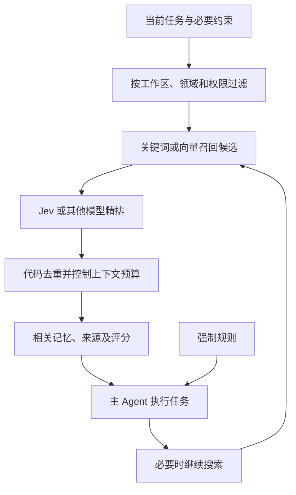

# Jev 模型调研与 Harness 应用判断

调研日期：2026-09-20。读者：希望理解模型原理、接入方式和选型边界的软件工程师。

资料来自官方文档、公开 SDK 和评测作者的原始仓库。本次未调用付费 API，未复跑公开评测。代码示例依据接口文档编写；示意概率、成本估算与实际测量分别标明。价格、权限和模型版本可能变化。

## 1. 结论

Jev 是 TypeSafe AI 提供的通用语义分类、评分服务。开发者在请求中定义问题、候选答案或评分标准，模型返回类型化结果及概率。它适合软件中的短小判断：分类、路由、筛选、排序、核验。

从功能上将它理解为“可以用自然语言动态定义任务的分类器”是合理的。分类、概率输出、零样本类别都已有成熟工作；Jev 的选型价值要看语义能力、概率质量、批量推理效率和成本的组合。

- 模型权重和完整训练实现未找到官方公开发布；当前按托管 API 评估。
- 当前版本只接受文本及文本结构化表示，不直接接受图片、音频和视频。
- 输出受类型约束，仍可能选错类别、评分错误或过度自信。
- 对 Harness，最值得试验的用途是记忆搜索的候选精排；整体检索接口应允许替换后端。
- 官方直连输入价格为每百万 tokens 0.042 美元，输出免费。按约 6.70 的美元兑人民币汇率，约为每百万输入 tokens 0.28 元。

来源：[产品介绍](https://docs.typesafe.ai/introduction)、[模型规格](https://docs.typesafe.ai/models)。

## 2. 输入和输出

一次请求包含业务状态 `state` 和问题集合 `questions`。每个问题通过 `instructions` 表达意图，必要时通过 `criteria` 定义选项或等级。

```text
待判断的数据 + 问题 + 候选答案/评分标准
                    ↓
                   Jev
                    ↓
         类型化结果与概率分布
                    ↓
       代码进行分流、排序或复核
```

### 2.1 Choice：单选分类

例如输入“请查一下 DNS 节点最近的 UDP 丢包”，问题为“主要需要什么能力”，候选为监控、文档、发布、其他。

以下为示意结果，省略 `confidence` 等字段：

```json
{
  "choice": "monitoring",
  "probabilities": {
    "monitoring": 0.93,
    "documentation": 0.02,
    "release": 0.01,
    "other": 0.04
  }
}
```

`choice` 是概率最高的选项，同时返回各选项的概率。0.93 描述模型的概率判断，不表示接口按该比例随机抽取最终答案。候选集合最多 255 项；真实输入可能超出集合时，应包含“其他”或“信息不足”。

它只能选择已给出的答案。询问“如何解决丢包”却没有提供候选方案，不会得到一篇排障方案。

来源：[Choice](https://docs.typesafe.ai/primitives/choice)。

### 2.2 Score：有序等级的概率加权平均

Score 接受 2～10 个有序等级，以 0 为起点编号。它返回每个等级的概率及等级编号的加权平均。

以“这条记忆对当前附件发送改动有多相关”为例：

| 等级 | 定义 | 示意概率 |
| --- | --- | ---: |
| 0 | 无关 | 0.00 |
| 1 | 背景关联 | 0.05 |
| 2 | 对实现有直接帮助 | 0.15 |
| 3 | 本次实现必须参考 | 0.80 |

```text
score = 0×0.00 + 1×0.05 + 2×0.15 + 3×0.80 = 2.75
```

2.75 表示靠近最高等级，不能解释为“正确率 91.7%”。相同均值也可能来自不同分布：全落在等级 1，与各有一半落在等级 0 和 2，都得到 1 分，但不确定性不同。

该例用于说明评分。真实系统中的强制规则应由代码固定加载，不能让相关性评分决定是否遵守。

来源：[Score](https://docs.typesafe.ai/primitives/score)。

### 2.3 Noul 与 confidence

Noul 返回一个命题成立的概率，范围 0～1，不附带独立 `confidence`。多标签任务可以每个标签问一个 Noul，各结果不需要相加为 1。[Noul](https://docs.typesafe.ai/primitives/noul)

Choice 和 Score 的 `confidence` 由概率分布计算。它是方便阈值判断的指标，不应直接当作正确率，也不能假定它等于最大类别概率。官方该说明页没有给出完整计算公式。[Confidence](https://docs.typesafe.ai/confidence)

## 3. 原理与训练披露边界

### 3.1 可确认的机制

官方描述包含受约束输出、新模型架构、并行采样和 RLCD 训练。一次调用可针对共享状态独立评估多个问题，避免为每个结果逐 token 生成自由文本。[发布说明](https://typesafe.ai/blog/introducing-system-one-models-and-jev)

这适合把复杂工作流拆成多个原子判断，再通过代码组合。若问题 B 依赖问题 A 的答案，需要显式组织多阶段调用；不能默认同批问题会互相读取答案。[并行模式](https://docs.typesafe.ai/patterns/fan-out)

### 3.2 RLCD 与概率校准

RLCD 全称为 Reinforcement Learning for Calibrated Decisions，目标是决策及其概率的校准。官方将它作为预训练语言模型的一种后训练方向介绍。

校准描述一组预测的统计性质：如果大量事件都被预测为 80% 概率，实际发生比例应接近 80%。它不保证某一次回答正确。准确率衡量选对多少；校准衡量概率是否符合实际频率，二者不能互相替代。[训练理念](https://docs.typesafe.ai/introduction/machine-learning-primer)

概率校准已有长期研究，其他模型也能通过温度缩放等方法做后处理校准。[On Calibration of Modern Neural Networks](https://arxiv.org/abs/1706.04599)

| 项目 | 本次查到的公开程度 |
| --- | --- |
| 优化目标、方法名称 | 已公开描述 RLCD 和校准决策 |
| 参数量、基础模型来源 | 未找到完整披露 |
| 网络架构、采样器实现 | 不足以复现 |
| 训练数据规模、来源配比 | 未找到完整说明 |
| 奖励函数、损失、优化算法 | 未找到足够复现的信息 |
| 是否蒸馏、教师模型 | 无法确认 |
| 训练硬件、时长、成本 | 未找到完整披露 |

因此不能将 PPO、GRPO、Brier loss 或某种 Transformer 结构自行补成 Jev 的具体实现。目前理解的是目标和接口，尚不能重建训练过程。

### 3.3 分类器、强化学习、Transformer 属于不同维度

| 维度 | 示例 |
| --- | --- |
| 任务 | 分类、回归、排序、生成、控制 |
| 网络架构 | CNN、Transformer、MLP |
| 学习方式 | 监督学习、自监督学习、强化学习 |
| 推理方式 | 一次分类、逐 token 生成、迭代去噪 |

一个模型可以使用 Transformer，先自监督预训练，再强化学习后训练，最终输出类别概率。输出概率不代表采用了强化学习，采用强化学习也不排斥 Transformer。[Transformer 原始论文](https://arxiv.org/abs/1706.03762)、[强化学习概念](https://spinningup.openai.com/en/latest/spinningup/rl_intro.html)

传统猫狗图像分类常用带标签数据监督训练。AI 绘画中的扩散模型学习去噪并迭代生成图像，也不能统一归入分类器或强化学习。[扩散模型论文](https://arxiv.org/abs/2006.11239)

公开材料不足以支持“Jev 已经摆脱语言模型预训练或 Transformer 路线”的结论。

## 4. 开放程度、产品与环境

| 对象 | 当前判断 |
| --- | --- |
| 官方 Jev 权重、训练代码 | 未找到公开发布，无法据此本地部署 |
| Python SDK | 公开源码，MIT；Python 3.10+，包名 `typesafe-sdk` |
| JavaScript/TypeScript SDK | 官方提供，Node.js 20+，包名 `@typesafe-ai/sdk` |
| System One Adapter | 用其他 LLM 实现类似接口，便于建立比较基线 |
| TypeSafe Console / Playground | 官方账号、凭据与交互试验入口 |
| Vercel AI Gateway | 已列出 Jev 和调用示例；本次未验证账号实际权限 |
| 官方 Agent Skill | 为编码 Agent 提供 API 知识，不包含模型权重 |

SDK 许可证不能推导成模型许可证。社区同名或仿制项目也不能自动视为官方权重或 RLCD 的复现。

来源：[Python 包配置](https://github.com/typesafe-ai/typesafe-sdk-python/blob/main/pyproject.toml)、[JavaScript SDK](https://docs.typesafe.ai/sdk/javascript)、[Adapter](https://github.com/typesafe-ai/system-one-adapter-python)、[Agent Skill](https://docs.typesafe.ai/agent-skill)。

调用端只需 HTTPS 访问及有效 API Key，无需 GPU、CUDA 或 PyTorch。官方直连接口为 `POST https://api.typesafe.ai/v1/systemone`，使用 Bearer 认证。[API](https://docs.typesafe.ai/api)

官方首页仍显示 Join Waitlist；其他平台有接入入口，所以应区分官方直连审批与网关账号权限。Vercel 示例的布尔类型为 `boolean`，原生 API 为 `noul`，不能直接混用字段。[TypeSafe](https://typesafe.ai/)、[Vercel 入口](https://vercel.com/ai-gateway/models/jev)

当前规格摘要：`jev-1.13.0`；请求总上下文 64k tokens，state 加最长问题不超过 32k；输入仅文本。公开限流为 250,000 tokens/秒及 1,200 请求/分钟，可能调整。英文是主要训练语言，中文需专项验证。官方目前不提供客户级 fine-tuning/LoRA。[Models](https://docs.typesafe.ai/models)

图片应用需先经 OCR 或视觉模型转成文本；音频需先转写。前处理误差和成本属于整个系统的一部分。

## 5. 最小使用示例

下面使用 Python 标准库，按官方 HTTP 接口构造工单分流请求。先通过环境变量注入有效的 `TYPESAFE_API_KEY`。示例只打印建议，不修改工单；未进行在线验证。

```python
import json
import os
from urllib.request import Request, urlopen

payload = {
    "model": "jev-1.13.0",
    "state": {
        "ticket": "Checkout returns HTTP 500 after deployment. All purchases fail."
    },
    "questions": {
        "route": {
            "type": "choice",
            "instructions": "Select the team responsible for the reported issue.",
            "criteria": {
                "billing": "Invoice, charge, or refund disputes.",
                "engineering": "Software failures or unavailable features.",
                "other": "Other issues or insufficient information."
            }
        },
        "urgent": {
            "type": "noul",
            "instructions": "Does the ticket report an ongoing purchase outage?"
        }
    }
}

request = Request(
    "https://api.typesafe.ai/v1/systemone",
    data=json.dumps(payload).encode("utf-8"),
    headers={
        "Authorization": f"Bearer {os.environ['TYPESAFE_API_KEY']}",
        "Content-Type": "application/json"
    },
    method="POST"
)
with urlopen(request, timeout=10) as response:
    result = json.load(response)

route = result["answers"]["route"]
# 0.85 仅用于演示；实际阈值必须由业务验证集确定。
queue = "manual_review"
if route["choice"] != "other" and route["confidence"] >= 0.85:
    queue = route["choice"]

print(json.dumps({
    "model": result["model"],
    "queue": queue,
    "route_probabilities": route["probabilities"],
    "urgent_probability": result["answers"]["urgent"]["noul"]
}, indent=2))
```

生产接入需要超时、限流、过载重试及失败降级。固定模型版本，记录实际版本与问题版本，升级后重测阈值。服务故障不能转成业务上的“通过”。[API 错误处理](https://docs.typesafe.ai/api)

## 6. 成熟替代方案

| 路线 | 代表 | 适用条件 |
| --- | --- | --- |
| 固定标签分类 | SetFit、领域分类模型 | 标签稳定，有少量标注，重视本地部署 |
| 零样本分类 | BART-MNLI、GLiNER 类方案 | 调用时指定候选类别 |
| 检索精排 | Cross-encoder、Cohere Rerank | query 与候选文档的相关性排序 |
| 通用 LLM 结构化输出 | Gemini 等 | 同时需要复杂推理、抽取或生成 |
| 确定性代码 | 正则、解析器、AST、规则引擎 | 条件能够精确定义 |

BART-MNLI 已能在调用时提供候选标签并得到分数；SetFit 支持少量标注训练文本分类器。动态类别和概率输出并非 Jev 首创。[BART-MNLI](https://huggingface.co/facebook/bart-large-mnli)、[SetFit](https://huggingface.co/docs/setfit/index)

Cohere Rerank 直接面向搜索重排；Gemini 支持 JSON Schema 输出。比较应使用满足需求的最便宜配置，不能只与高推理强度、大量输出的模型比较。[Cohere](https://docs.cohere.com/docs/rerank-overview)、[Gemini](https://ai.google.dev/gemini-api/docs/structured-output)

## 7. 评测、评价与局限

### 7.1 厂商数字的适用范围

官方展示 70～500 ms 延迟及最高约 193.6 倍速度、444.6 倍成本优势。工作流由内部团队设计，参考答案来自强模型概率，LLM 对照也输出概率，且运行地点接近美国西海岸服务。其最大倍数不能推广到所有部署与任务；与参考模型一致也不等于独立业务真值正确率。[官方方法及限制](https://typesafe.ai/blog/introducing-system-one-models-and-jev)

### 7.2 独立作者报告

以下是作者公布的结果，本次没有复跑。

| 实验 | 结果 | 解释边界 |
| --- | --- | --- |
| Python 代码规则检查 | Jev 中位延迟 0.75 秒，对照 Flash 3.59 秒、Fable 4.31 秒；correctness score 98% 对 100%、100% | 24 个小程序族及变体，每模型 360 次调用；不代表完整 PR 审查 |
| 合成评论五字段分类 | Jev 字段准确率 96.13%，Luna 97.13%；中位延迟 0.647 秒对 1.556 秒 | 100 条评论重复三次；Jev 有一次 API 失败；对照关闭 reasoning |
| Jev 与 GLiNER2.5 分类试验 | Jev 在 AG News 91%、Banking77/BTZSC 87%、Emotion 48% | 各 100 个样本；Emotion 上概率校准较差，16% 样本给真实标签零概率 |

来源：[代码规则实验](https://github.com/gemanor/jev-code-review-benchmark)、[评论分类实验](https://github.com/mameli/jev-vs-luna)、[概率评测](https://github.com/AbdelStark/jev-benchmarks)。

已有证据支持在部分任务上低成本、低延迟，但不同领域准确率和校准存在明显差异。不能由 RLCD 名称推导出任何领域都可靠。

### 7.3 已知弱点

官方列出字面表达敏感、计数和数学不可靠、日期比较困难、多跳关系较弱、无关长上下文干扰、对抗性输入可影响结果等问题。不同问题之间不保证逻辑恒等式：分别问 A 和非 A，概率不一定相加为 1；Choice 和 Noul 的阈值也不能直接互换。

“Zero Hallucinations”的结构约束不能消除错误判断。类型安全不能证明语义正确、权限成立或操作安全。[官方弱点清单](https://docs.typesafe.ai/model-jaggedness/jev-1.13)

## 8. Harness 场景：将记忆读取封装为搜索能力

结合已有记忆系统讨论与 [Harness 架构](../.harness/architecture.md)，建议将候选筛选作为可替换的搜索后端，暂不将 Jev 设为既定依赖。以下为用途分析，未将会话或内部业务资料发送给 Jev。



对 Agent 可暴露 `search_memory(query, scope, budget)`。索引和记忆由外部系统保存，Jev 只评估提供的候选。大规模信息库应先便宜召回，再精排，不能把全库逐次送入模型。官方也提供 BM25 召回后用 Jev 重排的案例。[重排案例](https://docs.typesafe.ai/cookbooks/rerank_typesafe)

记忆往往需要多条共同提供信息，适合逐条相关性评分后选取若干条，避免将全部候选强制变成一道单选题。分数表示相关性，不表示记忆事实一定正确。仍需要来源、时效和冲突管理。

| 场景 | 可交给 Jev 的部分 | 保留给代码、主模型或用户的部分 |
| --- | --- | --- |
| 记忆读取 | 相关性、适用性评分 | 索引、权限、强制规则、补充搜索 |
| 记忆整理 | 候选重复、冲突、长期/临时分类 | 生成内容、权威事实修改、删除 |
| Skill 推荐 | 从已有可用列表推荐候选 | App Server 发现、启停、最终列表与权限 |
| DNS 排障 | 已获取日志和证据的分类、排序 | 查询事实、算指标、实验与根因判断 |
| 文档检查 | 按明确标准标记缺项 | 技术设计和事实核验 |
| 发布流程 | 风险提示 | 授权、门禁和实际执行 |

收益来自减少主 Agent 的搜索轮次和无关上下文。如果新增精排调用后主模型仍重复读取全部资料，整体成本可能增加。

首次验证优先选“任务与候选记忆的相关性”，比较关键词/向量检索、专用 reranker、小 LLM 与 Jev。指标包括相关记忆漏选率、下游任务完成率、p95 延迟、完整模型费用。阈值在验证集确定，效果在独立测试集报告。

## 9. 定价、人民币换算与成本判断

### 9.1 官方直连价格

官方输入为 0.042 美元/百万 tokens，输出免费。输入包括状态和问题描述、候选标准等计费内容，最终以 API usage 和账单为准。[官方定价](https://docs.typesafe.ai/models)

2026-09-18 的公开汇率约为 1 美元 = 6.6996 元，取 6.70 估算。实际结算受支付渠道汇率和手续费影响；网关费用需另看渠道规则。[汇率来源](https://www.valutafx.com/history/usd-cny-2026-09-18)

```text
每百万输入 tokens 人民币费用
= 0.042 × 6.70
= 0.2814 元，约 0.28 元
```

| 每次计费输入 | 单次估算 | 1 万次估算 | 100 万次估算 |
| ---: | ---: | ---: | ---: |
| 1,000 tokens | ¥0.0002814 | ¥2.814 | ¥281.4 |
| 2,000 tokens | ¥0.0005628 | ¥5.628 | ¥562.8 |
| 10,000 tokens | ¥0.002814 | ¥28.14 | ¥2,814 |

以上为模型输入费估算，未包括重试、存储、检索、网关和后续模型。tokens 不等于汉字数。

### 9.2 为什么通常便宜

窄任务一般只需要当前状态、问题和相关证据，可以省去完整聊天历史；同时输入单价低、输出免费，共享状态的问题还可以合并请求。多个问题共享状态不等于额外问题不计费。[批量问题模式](https://docs.typesafe.ai/patterns/fan-out)

短上下文是应用设计带来的收益，普通 LLM 做同样的独立分类也可以只携带必要材料。反过来，Jev 若评估长文档或大量候选，输入仍会增长；缺少必要证据也会影响准确性。

以记忆搜索为例，假设召回 30 条、每条平均 300 tokens，查询及评分标准另计 1,000 tokens，总输入约 10,000 tokens：

```text
一次搜索的 Jev 费用约 0.002814 元
每天 1,000 次：约 2.81 元
30 天：约 84.42 元
```

这是预算模型，实际取决于请求组织和 usage。若每个候选单独调用会重复发送问题；若每轮扫描整个库，则可能失去便宜召回带来的收益。

### 9.3 工具调用、上下文和缓存

Agent 成本累积的单位是模型请求。一次模型响应可以发起多个工具调用，工具执行本身不一定触发模型续推；工具结果返回后再次请求模型时，通常需要包含或引用历史状态。具体系统也可能压缩、裁剪历史或只提供局部上下文，不能一概认为每个工具执行都按完整历史原价计费。

应区分两种概念：

- KV cache 是模型推理时复用注意力中间计算的机制，本身不定义 API 的收费方式。
- API prompt caching 是服务商提供的缓存命中与计费机制；能降低重复前缀费用，但有命中条件、有效期和相应费率。缓存命中通常也不意味着免费。

例如 Claude 文档将缓存写入、缓存读取与普通输入分别计费。不能将所有历史 token 都按未缓存价格估算，也不能认为 KV cache 让后续上下文零成本。[Prompt caching](https://platform.claude.com/docs/en/build-with-claude/prompt-caching)

通用 LLM 的任务费用还包括生成与推理 token、模型单价、请求轮次及工具费用。长上下文是原因之一。

可用以下方式比较整体成本：

```text
普通 Agent 费用
≈ 各轮（未缓存输入费 + 缓存读写费 + 输出/推理费）+ 工具费

加入 Jev 后的费用
≈ 召回与精排费 + 剩余 Agent 费用 + 失败重试/回退费用
```

最终要验证的是任务质量不下降时，省掉的主模型费用是否大于新增检索与精排费用。当前单价下，短输入、有限调用量的 Jev 判断通常很便宜；大规模全库扫描、重复调用和高回退率仍需单独估算。

## 10. 后续决策

本次完成资料调研与应用分析，未开展接入。保留独立搜索接口和可替换精排后端，待账号可用、任务样本明确后再做小规模比较。进入实现前确认中文效果、实际地域延迟、输入数据可发送范围、渠道权限以及模型版本；不根据宣传倍数直接决定架构。
