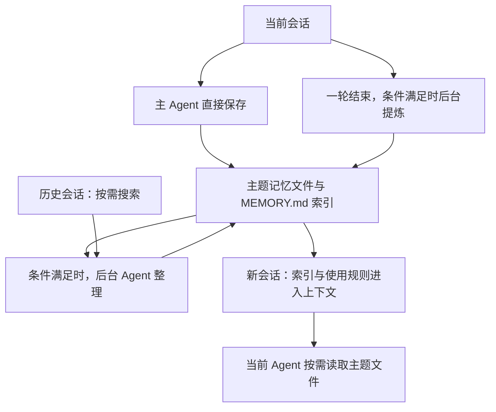

# Claude Code 记忆机制

Claude Code 使用 Agent 从会话中保存值得复用的信息，写成本地记忆文件，再在后续任务中按需读取。

本文按三个环节说明：

1. 保存记忆：主 Agent 直接保存，或由后台 Agent 提炼。
2. 后台整理：合并已有记忆，处理过期内容，精简索引。
3. 按需使用：将索引和使用规则放入上下文，由当前 Agent 读取详情。

> 核对时间：2026-09-17。产品行为参考官方文档；后台实现参考一份自述来自 2026 年 3 月泄露的[源码镜像][source]。镜像未与官方发布包独立校验，其中的开关与默认值仅用于理解该快照。

## 1. 架构

保存后即可供后续会话读取，后台整理独立触发。

`CLAUDE.md` 保存用户或团队明确维护的约定；自动记忆保存协作中积累的经验。本文主要说明自动记忆。见[官方说明][memory]。

## 2. 各环节设计

### 2.1 保存记忆

有两条写入路径，最终都通过文件工具更新 Markdown。

**主 Agent 直接保存**

主 Agent 自带记忆提示词，指导它判断什么值得保留、保存在哪里、如何更新已有内容。

- 执行时机：会话过程中，Agent 判断有值得保存的信息，或用户明确要求记住。
- 具体操作：读取已有记忆，写入或更新主题文件，再更新索引。
- 交付物：主题记忆文件、`MEMORY.md` 中的对应入口。

Agent 可以询问用户是否需要记住，但自动记忆没有逐条确认的固定要求。见[官方说明][memory]、[记忆提示词][memdir]。

**后台 Agent 提炼**

源码镜像中，一轮回答结束后会尝试异步启动提炼 Agent；需要后台提炼开关、自动记忆开关等条件满足。

- 具体操作：
  1. 从当前会话分叉一个 Agent，复用会话上下文和提示缓存相关参数。
  2. 根据处理游标，要求它只提炼新增消息中的信息。
  3. 通过工具读取已有记忆，更新主题文件与索引，最多执行 5 个模型轮次。
- 交付物：同样直接写入 Markdown 文件。

如果检测到主 Agent 已在对应消息区间调用工具写记忆，后台提炼会跳过。提炼抛错时保留游标，后续触发再尝试。见[提炼实现][extract]。

这里的“只提炼新增消息”是提示词要求；分叉 Agent 仍携带主会话上下文，输入量不能只按新增消息计算。

**保存什么**

| 类型 | 内容 |
| --- | --- |
| user | 用户的角色、经验和工作偏好 |
| feedback | 用户的纠正，以及确认有效的协作方式 |
| project | 代码之外的项目背景、期限和决策 |
| reference | 外部资料、看板等信息入口 |

提示词要求优先更新已有项，避免重复保存代码可以推导的信息、`CLAUDE.md` 已有约定和临时任务状态。见[分类与保存规则][types]。

### 2.2 后台整理

源码镜像中，AutoDream 会启动一个后台 Agent，整理已有记忆。

- 执行时机：一轮结束后尝试触发；有独立开关，默认阈值为距前次整理至少 24h，且至少有 5 个其他会话更新。
- 具体操作：
  1. 读取索引和相关主题文件。
  2. 有需要时搜索历史会话，补充依据。
  3. 合并重复信息，修正矛盾或过期内容。
  4. 精简索引，保留简短说明和文件入口。
- 交付物：更新后的主题文件和索引。

时间和会话数量只是触发条件，到点后仍需会话活动触发。见[整理实现][dream]、[整理提示词][dream-prompt]。

### 2.3 按需使用

由正在处理用户任务的普通 Agent 读取记忆。

- 执行时机：新会话构造上下文时，自动记忆已开启。
- 具体操作：
  1. 将记忆位置、使用规则和 `MEMORY.md` 索引正文提供给 Agent。
  2. Agent 根据当前问题，使用文件工具读取相关主题文件。
  3. 涉及会变化的信息时，检查当前状态，再用于回答或操作。

官方规定索引最多加载前 **200 行或 25KB**，以先达到者为准。接近上限时提醒 Agent 精简；超限写入仍成功，但会返回错误要求重写。主题文件按需读取。见[官方读取说明][memory]。

读取提示词要求对记忆中的文件、函数、开关等检查现状；发现旧结论与当前证据冲突时，更新或移除旧记忆。见[读取规则][types]。

## 3. 文件与更新

默认每个仓库有自己的记忆目录，同仓库的 worktree 共享。目录内主要有两类文件：

| 文件 | 内容 | 使用方式 |
| --- | --- | --- |
| MEMORY.md | 每条记忆的简短说明和文件链接 | 启动时按上限注入 |
| 各主题 Markdown | 名称、描述、类型，以及具体事实或经验 | Agent 按需读取 |

用户可以查看、修改、删除这些文件，也可以要求 Agent 记住、纠正或忘记。记忆文件不随历史会话保留期自动清理。删除后是否会从历史重新提炼，本轮尚未验证。见[官方说明][memory]。

[memory]: https://code.claude.com/docs/en/memory
[source]: https://github.com/MuhammadHananAsghar/claude-code/tree/2c931666fbbe1677ccc678f2caafb9c861b4ab1e
[memdir]: https://github.com/MuhammadHananAsghar/claude-code/blob/2c931666fbbe1677ccc678f2caafb9c861b4ab1e/src/memdir/memdir.ts
[types]: https://github.com/MuhammadHananAsghar/claude-code/blob/2c931666fbbe1677ccc678f2caafb9c861b4ab1e/src/memdir/memoryTypes.ts
[extract]: https://github.com/MuhammadHananAsghar/claude-code/blob/2c931666fbbe1677ccc678f2caafb9c861b4ab1e/src/services/extractMemories/extractMemories.ts
[dream]: https://github.com/MuhammadHananAsghar/claude-code/blob/2c931666fbbe1677ccc678f2caafb9c861b4ab1e/src/services/autoDream/autoDream.ts
[dream-prompt]: https://github.com/MuhammadHananAsghar/claude-code/blob/2c931666fbbe1677ccc678f2caafb9c861b4ab1e/src/services/autoDream/consolidationPrompt.ts
