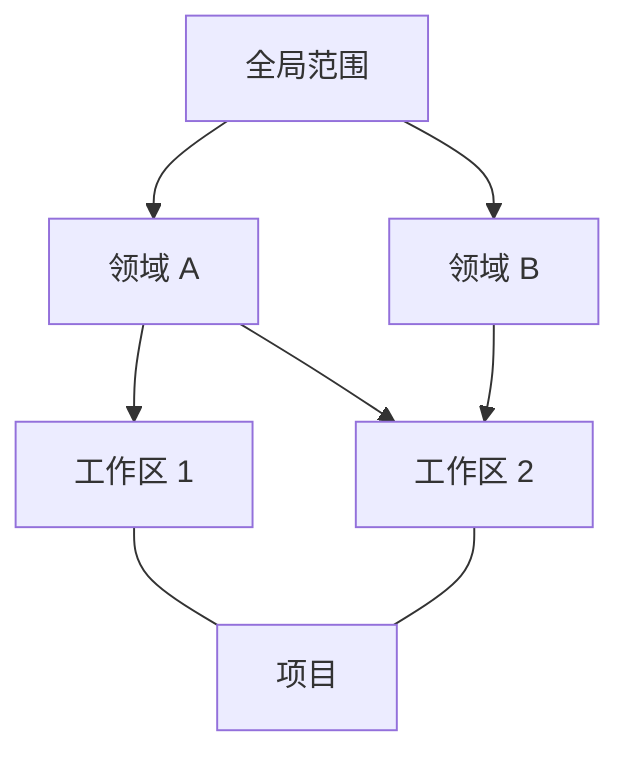

# Harness 记忆系统 Spec

> 状态：Spec v1.0 · 2026-09-18。初版范围与实施路线已确定, 后续按阶段完善细节并实施。待讨论项在对应阶段开始前对齐, 当前尚未进入开发。

## 1. 目标与范围

Harness 统一管理跨会话的知识和工作状态，让 Agent 及时保存、按需读取、持续纠正，让用户能够查看和控制这些变化。

此次聚焦微观记忆系统：整合规则与知识文档、记忆文件、项目文档插件和 handover 的管理，并提供实时保存与后台整理能力。

| 纳入整合的部分 | 职责 |
| --- | --- |
| harness 文档管理 | 管理 AGENTS.md、`.harness/` 等明确约定和稳定知识 |
| 记忆文件管理 | 管理偏好、事实、经验及其来源、适用范围和有效状态 |
| 项目文档插件 | 维护项目目标、当前状态、决策、进展与待办 |
| handover | 保存交接时点的快照，支持后续会话继续工作 |
| 实时保存与后台整理 | 为记忆提供保存、提炼、更新和维护能力 |

skills、recap、原始会话的核心机制不在本次改造范围。记忆可以引用已有来源，但本次不重建这些系统，不新增一套原始会话存储。

## 2. 概念与关联

### 2.1 关键名词与概念区分

1. harness 与 harness 文档: harness 指本项目, 或称 codex harness; harness 文档指的是 AGENTS.md, CLAUDE.md, .harness/, 这些是会被 agent 原生机制读取的信息, 适合存放一些通用规则与偏好
2. 项目文档插件: harness 的插件之一, 绑定会话后, 会在会话一开始注入项目文档全文, 并提供了 skill 以使 agent 主动写入项目文档, 同时提供了归档按钮以供用户主动触发文档记录
3. handover: 是一个 harness 的命令, 执行后会发送固定的上下文给 agent, 并在收到结果后解析其结果并开启新的上下文并注入 handover 文案
4. 记忆文件: harness 要直接管理的记忆文件

### 2.2 三类长期知识范围

| 范围 | 含义 | 示例 |
| --- | --- | --- |
| 全局 | 适用于用户跨工作区协作的知识与已确认偏好 | 用户明确要求的通用协作偏好 |
| 领域 | 在相关工作区之间长期复用的知识 | DNS 数据面、Agent 记忆系统 |
| 工作区 | 适用于具体工作环境的知识 | dns-agent、dpdkdns、codex-harness |

三类范围形成分层组织，领域与工作区可以多对多关联。一个领域覆盖多个工作区，一个工作区也可关联多个领域，因此不采用严格目录树表达全部关系。



### 2.3 项目概念独立保留

项目围绕一个目标组织状态和协作，有阶段、决策、待办与完成状态。领域围绕长期知识组织复用；项目完成后可归档，领域仍然存在。

项目只与工作区有直接关联，不直接关联领域。项目可以涉及多个工作区；领域知识通过工作区关系参与读取。

例如，“DNS 增量同步改造”属于项目，可以关联 dns-agent 和 dpdkdns 工作区；项目形成的长期经验可以提炼到 DNS 领域。项目中的未决方案、临时进展和待办保留在项目内。

项目不作为全局、领域、工作区之外的第四类长期范围。项目正文和交接快照仍应有明确的可用上下文，不能因统一管理就向无关会话提供。

## 3 核心设计

### 3.1 Harness 文档

这个文档分为两块:

1. 全局 AGENTS.md: 管理权在 harness, 用于存放跨工作区适用的规则与偏好
2. 各工作区内的 AGENTS.md 与 .harness/: 管理权在各自的 git 仓库, 用于存放工作区规则和稳定知识

AGENTS.md 保持简短, 放通用规则与文档入口; 详细的架构、流程和坑点放在 .harness/ 中, 由 agent 按需读取。

> CLAUDE.md 应以软链接的形式指向 AGENTS.md, 避免维护两份规则。已有独立 CLAUDE.md 的工作区如何合并内容, 需要在接入时处理, 不直接覆盖。

#### 写入/修改时机

1. 用户明确要求把某条规则或偏好写入 harness 文档
2. agent 在显式记忆时, 判断内容已经明确且适合长期适用
3. dream 整理记忆时, 发现可以提升为稳定规则或知识的内容

后两种情况可以先形成修改建议。全局文档通过 harness 管理入口修改; 工作区文档按各仓库原有的修改与审查方式处理。是否允许 agent 自动修改全局 AGENTS.md, 待定。

一般经验先保存在记忆文件中。提升到 harness 文档后, 记忆文件保留对应文档的入口与适用条件, 不再维护另一份完整正文。

#### 读取方式

沿用 agent 原生的文档读取机制。harness 提供查看和管理入口, 不再重复注入原生机制已经加载的正文。

领域目前先通过记忆文件组织。是否需要单独的领域规则文档, 后续再确定。

### 3.2 Harness 记忆文件

这部分由 harness 直接管理, 用于保存会话中形成的偏好、事实、经验与知识入口。显式记忆和 dream 都读写这部分文件。

#### 组织形式

按全局、领域、工作区三个范围组织, 每个范围包含简短索引与记忆正文。目录规划如下, 标识规则与文件模板在实施阶段 1 对齐。

```text
记忆文件目录(~/.codex-harness/memory/)
├── 全局(~/.codex-harness/memory/global/)
│   ├── 索引(memory_summary.md)
│   ├── 记忆正文(MEMORY.md)
│   └── 历史记忆(轮转)(MEMORY-<YYYYMMDD>.md)
├── 领域(~/.codex-harness/memory/domain/)
│   └── 领域标识 (~/.codex-harness/memory/domain/<领域标识>/)
│       ├── 索引(memory_summary.md)
│       ├── 记忆正文(MEMORY.md)
│       └── 历史记忆(轮转)(MEMORY-<YYYYMMDD>.md)
└── 工作区(~/.codex-harness/memory/workspace/)
    └── 工作区标识(~/.codex-harness/memory/workspace/<工作区标识>/)
        ├── 索引(memory_summary.md)
        ├── 记忆正文(MEMORY.md)
        └── 历史记忆(轮转)(MEMORY-<YYYYMMDD>.md)
```

领域与工作区的关联由 harness 维护。一个工作区关联两个领域时, 可以读取两个领域的相关记忆。

##### 索引文件形式

索引用于告诉 agent 有哪些内容、到哪里读取; 正文保存具体结论。每条记忆至少需要包含:

| 信息 | 用途 |
| --- | --- |
| 标识与内容 | 找到和修改同一条记忆 |
| 类型与范围 | 区分偏好、事实、经验、引用, 确定适用的全局、领域或工作区 |
| 来源 | 关联原会话、项目文档或 harness 文档, 能回查依据 |
| 时间与适用条件 | 记录写入时间, 按需补充验证时间、有效时间、版本和环境 |
| 状态与替代关系 | 知道内容是否有效, 是否已经被纠正或替代 |

模板在实施阶段 1 补充。

##### 记忆正文形式

模板在实施阶段 1 补充。

#### 写入时机

1. 显式记忆: 用户或 agent 在会话中主动保存, 见 3.3
2. 隐式记忆: dream 从会话中补充提炼, 或整理已有内容, 见 3.4

两条路径使用同一套保存与更新规则。写入前检查已有内容, 重复结论合并或跳过, 新结论与旧结论冲突时保留依据和适用条件, 不只按时间先后覆盖。

写入范围结合当前任务确定, 不能只看启动目录。例如在 dns-agent 工作区讨论 harness 设计, 结论不应直接存入 DNS 工作区记忆。


#### 纠正与遗忘

用户可以通过 agent 或管理入口纠正、调整范围、忘记某条内容。

| 操作 | 行为 |
| --- | --- |
| 纠正 | 更新当前结论, 旧结论不再作为当前事实提供 |
| 转冷 | 减少自动注入, 需要时仍可检索 |
| 失效或被替代 | 普通任务不采用, 查询历史时可以区分当时状态 |
| 忘记 | 立即停止后续召回, 同一历史输入再次整理时也不能恢复它 |

纠正和忘记不等待 dream。正文、索引和摘要等派生内容需要同步处理; 已经进入当前会话上下文的旧内容, 需要另外告知 agent 已被纠正或失效。

忘记记忆不自动删除原始会话。彻底删除数据的范围、防止重新提炼的标记方式, 以及用户重新要求记住时如何恢复, 待定。

### 3.3 显式记忆

分为两种情况:

1. agent 主动提出记忆: 发现用户纠正、已验证的结论或值得复用的经验时, 主动保存
2. 用户主动提出记忆:
   - 提供显式的按钮来进行记忆
   - 主动对 agent 提及需要记忆

这里的显式指会话中主动发起保存, 不要求必须由用户提出。

#### 执行流程

1. 整理需要保存的内容与来源
2. 判断应该写入 harness 文档还是记忆文件, 并确定适用范围
3. 检查已有内容, 执行新增或更新
4. 保存成功后展示结果, 用户可以查看、编辑、调整范围或忘记

普通记忆默认保存后展示, 不逐条要求确认。harness 文档的修改按 3.1 的方式处理。

展示可以采用类似 recap 的卡片, 但不修改 recap 本身。卡片包含保存内容、范围、来源和操作入口; 同一轮保存多条内容时可以合并展示。

只有持久化成功才展示“已记住”。失败或待处理时展示真实状态。用户点击按钮后, 是保存选中的内容还是让 agent 提炼当前会话, 需要继续确定。

#### 实现方式

| 方案 | 作用 | 需要解决的问题 |
| --- | --- | --- |
| 启动时注入上下文 | 告知 agent 当前的记忆范围、读取入口, 以及什么情况下应主动记忆 | 保持提示简短, 具体写入仍需要工具或命令 |
| 提供全局 skill | 描述保存、更新、忘记的具体步骤, agent 使用时再读取 | skill 存在不保证 agent 在每次需要时都会主动调用 |

agent 主动记忆通过全局 skill 实现, 并提供开关。开关控制 agent 自主保存, 关闭后仍允许用户明确要求保存。

启动时配合简短说明, 告知 agent 当前记忆范围、读取入口和主动记忆开关状态; 详细操作放在 skill 中。保存结果由 harness 校验并记录, 再形成展示卡片。

skill 使用现有机制, 不改它的核心实现。底层写入使用什么工具或命令, 以及恢复会话时如何补充说明, 在对应阶段确定。

### 3.4 隐式记忆 - dream

dream 在后台调用 LLM 或 agent 整理会话与已有记忆, 主要负责补充提炼、合并、转冷和失效维护。

#### 触发时机

初步考虑以下入口:

1. 会话一段时间没有新活动, 且存在尚未整理的内容
2. 用户手动触发整理
3. 项目归档或阶段结束时触发整理

任务排队后, 在系统空闲或资源允许时执行。空闲如何判断、执行间隔、并发数量, 以及关闭 harness 后是否继续运行, 待定。

#### 输入与输出

| 输入 | 用途 |
| --- | --- |
| 尚未处理的会话内容 | 补充提炼实时保存遗漏的信息 |
| 相关范围内的已有记忆 | 去重、合并、识别冲突 |
| 用户纠正、忘记记录 | 防止旧结论重新进入记忆 |
| 关联文档及来源版本 | 判断内容是否已经进入文档, 或来源是否发生变化 |

输出为记忆的新增、更新、转冷或失效处理, 以及索引调整。适合进入 harness 文档的内容形成修改建议, 按 3.1 处理。

原始会话沿用现有存储。读取哪些消息、是否包含工具结果、长会话如何分段, 在实现设计中确定。

#### 执行流程


需要注意:

1. 记录已处理进度, 不每次从头整理全部历史
2. 识别显式记忆已保存的内容, 避免重复写入
3. 用户在 dream 运行期间纠正或忘记内容时, 旧任务结果不能覆盖新操作
4. 保存失败可重试, 多个任务并发时不能静默覆盖
5. 旧知识可以转冷, 但不能仅因时间久就删除仍然可靠的结论

dream 的结果在 harness 中可查看。是否采用汇总卡片、独立任务列表或记忆变更记录, 待定。

### 3.5 记忆读取

读取分为两部分:

1. 自动提供: 会话开始时提供简短的记忆说明与入口, 按任务补充相关内容
2. agent 按需读取: 根据当前问题查询记忆正文, 必要时回查来源


全局、领域、工作区决定内容是否适用, 不代表全部内容都要注入。预算、索引形式与检索方式待定。

harness 文档已由原生机制读取的部分不重复提供。项目文档、handover 和记忆指向同一结论时, 尽量保留一个正文和对应来源。

harness 应能展示本次提供了哪些记忆、来源是什么。“已提供给模型”与“回答引用了记忆”分开展示, 不把注入直接视为实际使用。

### 3.6 项目文档与 handover 的整合

#### 项目文档插件

项目文档继续管理项目目标、状态、决策和待办。统一记忆系统负责管理入口、来源关联, 以及从中提炼可复用结论。

1. 项目内的临时进展和未决方案留在项目文档
2. 已确认且可复用的结论可以进入工作区或领域记忆, 保留项目来源
3. 项目归档后, 已提炼的长期知识可以继续使用

现有的绑定、全文注入和文档写入方式是否调整, 需要单独确定。最终希望避免与记忆重复注入, 但不在这里预定用摘要替换现有全文。

#### handover

handover 继续负责把当前工作交给新会话, 交接内容保留生成时点的快照。

1. 未完成工作、当前状态和下一步保留在交接内容中
2. 已进入记忆或 harness 文档的长期知识, 可以通过引用提供
3. 从旧交接内容恢复时, 需要补充后来发生的纠正或失效信息

历史快照不由 dream 改写。handover 文案中保留多少正文、引用如何在新会话中读取, 待定。

## 4 实施路线

从简单到复杂, 逐步实施。每个阶段先补齐对应设计, 再实施与验证, 将结果更新到本文。

### 4.1 对齐目录架构与文件模板

1. 确定全局、领域、工作区的目录与标识规则, 区分 repo、worktree 和非 Git 目录
2. 确定领域与工作区关联的管理方式
3. 补齐 memory_summary.md 与 MEMORY.md 的模板, 明确记忆的稳定标识、来源、范围和状态
4. 确定索引与正文的更新规则, 以及纠正和忘记记录如何保留

历史记忆目录先预留, 具体轮转策略放到后续阶段。

### 4.2 实现查看与编辑界面

实现类似于当前 harness tab 的查看与编辑界面, 能按全局、领域、工作区查看文档与记忆。

1. 支持查看来源、编辑内容和调整记忆范围
2. 提供用户主动纠正与忘记的入口, 不等待 dream
3. 编辑或忘记后同步更新索引, 展示保存成功或失败的真实状态
4. 工作区 harness 文档的修改沿用各仓库原有流程

### 4.3 实现用户指定记忆

新增按钮用于总结信息到记忆文件与 harness 文档中, 同时支持用户直接对 agent 提及需要记忆。

1. 对齐按钮处理的是当前会话还是选中内容
2. 展示待保存内容的目标范围、目标文件和最终保存结果
3. 使用同一套保存与更新规则, 避免重复结论反复新增
4. 写入工作区 harness 文档时, 沿用仓库修改与审查流程

### 4.4 实现记忆的使用

在会话开始时注入短索引和必要内容, 记忆正文由 agent 按需读取。

1. 按当前工作区、关联领域与任务确定可用记忆
2. 明确注入预算, 不全量注入所有正文, 不重复注入原生机制已加载的 harness 文档
3. 补齐恢复旧会话时的更新方式, 让纠正、忘记和范围变化生效
4. 能查看本次提供了哪些记忆及其来源

阶段 3、4 完成后形成首个完整可用版本: 用户要求记住 → 保存并可编辑 → 新会话能够使用。

### 4.5 实现 agent 主动记忆

通过全局 skill 实现主动记忆, 并提供开关。

1. 启动说明包含主动记忆开关状态与 skill 入口
2. 开关只控制 agent 自主保存, 关闭后仍允许用户明确要求保存
3. 保存后展示结果, 用户可以纠正、调整范围或忘记
4. 与用户指定记忆共用写入规则, 不另外维护一套存储

### 4.6 实现 dream 整理逻辑

实现会话增量提炼、已有记忆合并与索引维护。

1. 对齐触发条件、输入边界和运行生命周期, 记录处理进度
2. 避免重复提炼显式记忆已经保存的内容
3. 提交前检查最新纠正与忘记记录, 旧任务不能覆盖用户的新操作
4. 支持失败重试与并发写入处理, 整理结果可查看

从本阶段开始处理历史会话时, 就必须防止已忘记的内容重新生成, 不推迟到阶段 7。

### 4.7 实现 dream 遗忘逻辑

实现自动转冷、失效维护与历史轮转, 处理长期积累后的记忆体积和时效问题。

1. 对齐转冷、失效和轮转条件, 不仅按时间决定是否保留
2. 保留历史查询需要的来源与替代关系
3. 轮转后的内容仍遵守纠正和忘记状态, 不能通过历史文件恢复旧结论

用户主动忘记已在阶段 2 提供, 本阶段补充自动维护策略。

### 4.8 项目文档与 handover 的接入

阶段 1–4 先保留两者现有行为。基本读写完成后, 再细化接入方案并安排实施, 不作为首个可用版本的前置条件。

接入时补齐统一管理入口、来源关联、可复用结论提炼和重复注入处理; handover 保留交接快照, 恢复时补充后来发生的纠正或失效信息。具体排在阶段 5–7 的哪个位置, 根据依赖确定。

## 5 待讨论的问题

| 问题 | 当前思路 |
| --- | --- |
| 主动记忆 skill 如何调用写入能力? | 已确定全局 skill 配合简短启动说明与主动记忆开关; 底层工具或命令、恢复会话的更新方式待定 |
| 全局 AGENTS.md 是否允许自动修改? | 用户明确要求时可通过 harness 修改; agent 和 dream 的自主修改边界待定 |
| 工作区如何识别? | 需要区分 repo、worktree 和非 Git 目录, 不能只依赖路径 |
| 领域与工作区如何关联? | 由 harness 管理多对多关系; 用户操作入口与 agent 建议方式待定 |
| 跨工作区项目默认读取哪些内容? | 项目只直接关联工作区; 会话是否读取其他关联工作区需要定义 |
| 一条记忆如何落文件? | 按范围使用 memory_summary.md 与 MEMORY.md; 正文内条目结构、元数据位置和历史轮转规则分阶段确定 |
| dream 如何调度? | 增量整理并保留进度; 空闲条件、执行模型和退出后行为待定 |
| 忘记如何防止重新生成? | 后续召回立即停止, 后台提交必须检查; 标记和恢复方式待定 |
| 是否复用 Codex 原生 memory? | 暂不启用, 后续按能力选择; 同一范围避免重复提炼和注入 |

## 6 验证场景

开发后至少验证以下行为, 具体用例随设计补充。

| 场景 | 预期 |
| --- | --- |
| 保存后开启新会话 | 适用范围内能够读取, 并能回查来源 |
| 两个工作区关联同一领域 | 领域知识可复用, 工作区专属内容不自动共享 |
| 同一工作区关联两个领域 | 按任务读取相关内容, 不全量注入 |
| 用户纠正后 dream 完成 | 采用纠正后的内容, 旧任务不覆盖新结论 |
| 忘记后重新整理旧会话 | 正文和索引不再召回, 旧内容不重新生成 |
| 记忆提升到 harness 文档 | 文档保存正文, 记忆保留入口 |
| 从旧 handover 恢复 | 能区分交接时状态与后来纠正的内容 |
| 重复写入、并发或失败重试 | 不重复膨胀, 不静默丢失更新 |

## 7 参考文档

- [Codex 原生记忆机制](codex%20memory.md)
- [Claude Code 记忆机制](claude%20code%20memory.md)
- [Harness 架构约定](../../.harness/architecture.md)
- [现有协作约定](../../.harness/memory.md)
