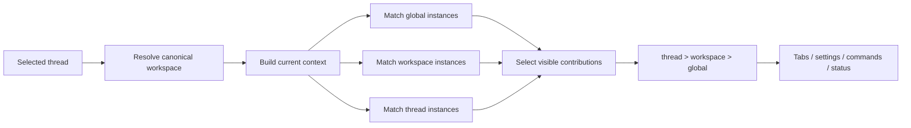
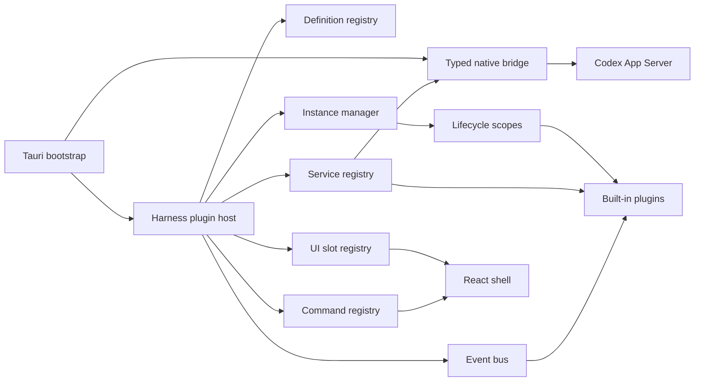
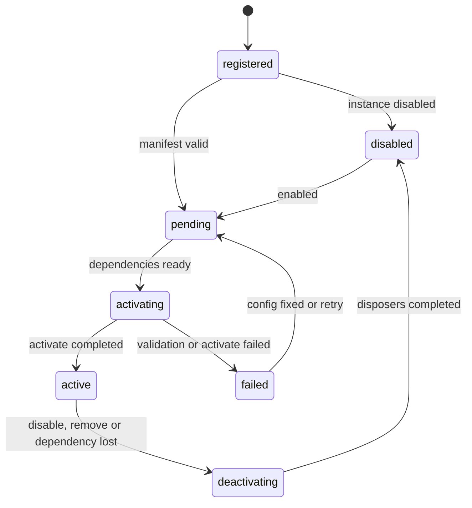
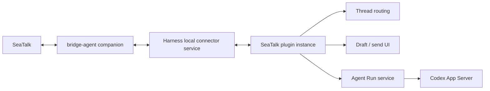

# 阶段 2：Harness 插件系统技术方案

## 结论

阶段 2 只建设 Codex Harness 自身的插件系统。Codex Skills、MCP、模型、Agent loop、审批和会话持久化继续由 Codex App Server 管理，不进入 Harness 插件模型。

插件系统的核心对象是“有归属的插件实例”：同一份插件定义可以创建实例，实例归属于全局、某个 workspace 或某个 thread。实例拥有独立配置、状态、运行记录和 UI；Harness 根据当前 thread 与 workspace 解析可见贡献，同时保证后台任务不会因为用户切换页面而被销毁。

阶段 2 按三个垂直切片交付：

1. 插件内核、作用域、设置页，并把“轨迹”迁成首个内置插件。
2. Agent Run 能力与“临时 Agent”插件，验证后台任务、父子 thread 和插件间 service。
3. SeaTalk 插件，复用现有本地 bridge 作为通信数据面，验证外部连接、路由、草稿确认和长期运行状态。

第一阶段只加载随 App 构建发布的可信内置插件。外部 Harness 插件等内核经过上述真实场景验证后再设计安装、隔离和升级机制。

现有项目边界保持不变：[原生 bridge](../src/core/runtime/bridge.ts) 仍是 React 访问原生能力的唯一入口，[App Server transport](../src-tauri/src/app_server.rs) 仍是唯一直接接触 Codex App Server 协议的模块。插件只能使用 Harness 提供的类型化服务。

## 目标与范围

[V1 README](../README.md) 已把插件运行时列为后续范围，[extensions types](../src/extensions/types.ts) 也预留了最小边界。当前 Tab 和设置由 [App](../src/App.tsx) 直接组装，继续加入监控、任务、DB、通信等能力会让入口组件和 [useHarness](../src/features/conversation/useHarness.ts) 持续膨胀。

阶段 2 需要满足：

- 插件实例可归属于 `global`、`workspace` 或 `thread`。
- 插件拥有独立设置页面，Harness 统一管理启停、归属、权限和错误状态。
- 插件可以注册独立 Tab、设置区、命令、状态入口和后台任务。
- 插件之间通过类型化 service 与 event 协作，不直接导入彼此内部实现。
- 插件的注册和副作用可统一释放，单个插件失败不影响会话、消息发送和审批。
- 本地 SQLite 只保存 UI 配置和索引，不保存会话正文、凭据或 token。

阶段 2 暂不包含：

- Codex 插件、Skills 或 MCP 的安装和管理。
- 替换 App Server 的 Agent loop、沙箱、审批或会话存储。
- npm、Git 或任意外部代码的动态加载。
- 公共插件市场。
- 允许模型直接调用 Harness 插件；该能力属于 App Server 的工具边界。

## 调研结论

### DeepSeek Harness

调研基于 DeepSeek Harness commit [`b150a551`](https://github.com/deepseek-ai/deepseek-harness/tree/b150a551b8d465e31e418e1b2eaf5e79bbb7d28e)。它用 Cordis 管理插件依赖、加载和卸载，模型、工具、会话、存储、Agent loop 与 UI 都由插件提供。插件通过 `apply(ctx)` 获取 service，监听 event，并把 disposer 绑定到生命周期；UI 通过 slot 注册。

| DeepSeek Harness 机制 | 对本项目的启发 | 本项目取舍 |
|---|---|---|
| 薄内核与插件依赖图 | 插件系统需要成为稳定的组合边界 | 只插件化 Harness 能力，Codex runtime 留在 App Server |
| `apply(ctx)` 与 Fiber 生命周期 | 注册、监听、定时器和连接需要统一释放 | 实现 instance scope 与逆序 disposer |
| service + event | 插件可以低耦合协作 | service 处理请求/返回，event 广播事实 |
| UI slots | 页面骨架和功能贡献可以分离 | Tab、设置、Composer、侧边栏使用稳定 slot |
| profile / bundle / patch | 分发和实例配置需要分层 | 首版用内置定义 + SQLite 实例配置 |
| Host / Client 插件 | 后台逻辑不应依赖 React 组件是否挂载 | instance runtime 与 UI contribution 分离 |
| npm / Git 安装 | 安装脚本带来宿主机执行风险 | 外部插件推迟，首版没有动态代码加载 |

DeepSeek Harness 的 Client unload 链仍记录有未完成项。Harness 插件内核必须用测试证明 listener、timer、slot、service 和连接都能释放，不能依赖 React 自然卸载。

相关资料：

- [DeepSeek Harness architecture](https://github.com/deepseek-ai/deepseek-harness/blob/b150a551b8d465e31e418e1b2eaf5e79bbb7d28e/docs/architecture.zh.md)
- [插件生命周期](https://github.com/deepseek-ai/deepseek-harness/blob/b150a551b8d465e31e418e1b2eaf5e79bbb7d28e/docs/user/develop/framework/index.zh.md)
- [插件打包与 profile 组合](https://github.com/deepseek-ai/deepseek-harness/blob/b150a551b8d465e31e418e1b2eaf5e79bbb7d28e/docs/user/develop/basic/publish.zh.md)
- [Host / Client 模块图](https://github.com/deepseek-ai/deepseek-harness/blob/b150a551b8d465e31e418e1b2eaf5e79bbb7d28e/docs/subsystems/client-modules.zh.md)

### 现有 SeaTalk 实现

相邻项目里已有三条可复用的经验：

- `bridge-agent` 把 SeaTalk WebSocket/OpenAPI、事件去重、消息归一化和 SQLite 审计作为通信数据面，通过本地 HTTP/SSE 服务上层消费者；Codex runtime 位于其上层。
- dshbot 的 `seatalk-channel` 插件已经验证：单聊与群 thread 映射到独立持久会话、同一会话串行处理、忙时排队/插队、审批 fail-closed、动态进度、失败重试和 workspace 绑定。
- `digital_employee` 的 AI reply 方案采用“生成草稿—编辑—显式确认—发送”，生成失败和发送失败都保留可检查状态。

因此 SeaTalk 插件应复用 bridge 的通信能力，Harness 负责会话路由和交互；首版出站消息必须经过可编辑草稿与显式确认。

## 核心模型

### 插件定义、实例与归属

插件定义描述代码和能力，插件实例描述一次具体启用及其归属：

```ts
export type PluginScope =
  | { kind: 'global' }
  | { kind: 'workspace'; workspaceRoot: string }
  | { kind: 'thread'; threadId: string }

export interface PluginManifest {
  schemaVersion: 1
  id: string
  name: string
  version: string
  engine: { codexHarness: string }
  supportedScopes: Array<PluginScope['kind']>
  requires?: string[]
  optional?: string[]
  permissions?: PluginPermission[]
}

export interface PluginInstanceRecord {
  instanceId: string
  pluginId: string
  scope: PluginScope
  enabled: boolean
  config: unknown
  createdAt: number
  updatedAt: number
}
```

归属的语义：

| 归属 | 典型用途 | UI 可见范围 | 生命周期 |
|---|---|---|---|
| `global` | SeaTalk 连接、全局任务列表 | 所有 thread，或插件自己决定 | App 运行期间 |
| `workspace` | 监控、DB、项目任务 | 当前 thread 属于该 workspace 时 | 实例启用期间 |
| `thread` | 临时 Agent、某次调查面板 | 只在指定 thread | 实例启用期间 |

“归属”与“当前选择”分开处理。workspace/thread 实例在用户切换会话后仍然存活，避免后台查询、git push 或消息监听被取消；slot registry 只隐藏当前上下文不匹配的 UI。

同一插件可以在不同 owner 下创建多个实例。首版约束每个 `plugin_id + scope` 只有一个实例。当前资源同时命中同一插件的多个实例时，UI 和新的上下文事件使用 `thread > workspace > global` 的最具体实例；其他实例已经启动的后台任务和连接继续运行。各实例的配置相互独立，运行时不做隐式合并。

workspace scope 使用 canonical git root 作为稳定 key。thread scope 使用 App Server thread id；thread 的 workspace 关系继续由现有映射逻辑解析。

### 上下文解析



没有选中 thread 时只显示 global contribution。无法解析 workspace 的 thread 仍可使用 global 与 thread 插件，不会被归到错误 workspace。

## 插件内核

### 组件边界



应用核心保留启动、App Server 连接、类型化 bridge、全局 shell、plugin host、安全策略和错误边界。功能插件注册 UI 与工作流，不持有 App Server wire protocol。

### 插件契约

```ts
export interface HarnessPlugin {
  manifest: PluginManifest
  activate(ctx: PluginInstanceContext): void | Promise<void>
}

export interface PluginInstanceContext {
  pluginId: string
  instanceId: string
  scope: PluginScope
  config: Readonly<unknown>
  services: ServiceRegistry
  events: EventBus
  slots: SlotRegistry
  commands: CommandRegistry
  storage: PluginStorage
  signal: AbortSignal
  effect(disposer: () => void | Promise<void>): void
}
```

约束：

- manifest 在实例激活前校验版本、scope、依赖和权限。
- `requires` 指依赖的 service；缺失、循环依赖或版本不兼容时实例进入 `failed`。
- 所有 slot、command、listener、timer 和连接注册到当前 instance lifecycle scope，停用时逆序释放。
- `PluginInstanceContext` 不暴露 Tauri `invoke`、原始 WebSocket、SQLite connection 或 App Server request。
- React component 的卸载只负责视图资源；后台资源由 instance disposer 管理。

### 生命周期



用户切换 thread 不触发 `deactivating`，只触发可见 contribution 重新解析。关闭实例、删除实例、应用退出或必需 service 消失才释放实例。

### Service 与 Event

Service 用于有所有者、需要返回值的能力；Event 用于广播稳定事实。首批 core services：

| Service | 能力 | 约束 |
|---|---|---|
| `harness.threads` | 读取 thread 投影、创建/恢复 thread、提交 turn、取消 turn | 不暴露 raw App Server request |
| `harness.agentRuns` | 创建、观察、取消有来源信息的后台 Agent Run | 由 core 适配 thread/turn RPC |
| `harness.workspaces` | 读取 workspace、解析 canonical root、打开选择器 | 原生调用仍经 typed bridge |
| `harness.preferences` | 读写实例允许的 UI 配置 | 不保存凭据和会话正文 |
| `harness.notifications` | toast、任务完成和可恢复错误 | 自动附加 plugin/instance id |
| `harness.localConnectors` | 访问获准的 localhost companion service | 域名、端口和操作受 permission 限制 |

首批 event 包括 `thread:selected`、`thread:updated`、`workspace:resolved`、`agent-run:updated`、`transport:connected` 和 `appearance:changed`。App Server 原始通知先在 core 归一化，插件不依赖 wire payload。

插件也可以提供 service。例如 SeaTalk 插件可以提供 `seatalk.drafts`，任务插件可以消费它；service 名必须带插件 namespace，卸载时自动撤销并通知依赖实例。

### UI slots 与 command

| Slot id | 模式 | 用途 |
|---|---|---|
| `conversation.tabs` | 多占、有序；同插件取最具体实例 | 轨迹、监控、任务、DB Tab |
| `conversation.item.renderers` | chain；首个匹配者生效 | 自定义消息或运行记录展示 |
| `composer.actions` | 多占、有序 | 临时 Agent、生成 SeaTalk 草稿 |
| `sidebar.status` | 多占、有序 | 连接状态、后台任务数量 |
| `settings.plugins` | 每实例一个页面 | 插件业务设置 |

Tab contribution 至少包含稳定 id、标题、图标、排序、`when(context)` 与 component factory。Tab 的选中状态由 shell 管理；当前 Tab 因 scope 切换消失时回退到“对话”。插件 component 由独立 error boundary 包裹。

插件 command 包含稳定 id、标题、可用条件和 handler。按钮、快捷键和未来 command palette 触发 command，不直接引用插件模块。host 负责异常捕获、取消信号和运行来源记录。

## 设置与持久化

### 设置界面

当前 [SettingsDialog](../src/features/settings/SettingsDialog.tsx) 扩展为两层：

1. Harness 管理的插件列表：安装状态、版本、启停、健康状态和“新建实例”。
2. 实例设置页：顶部由 Harness 渲染归属类型和 owner 选择器，下面挂载插件自己的设置 component。

Harness 始终拥有以下字段，插件不能覆盖：

- `enabled`
- `scope.kind`
- workspace/thread owner
- permissions 与外部连接授权
- 删除实例、重试激活和诊断入口

插件只管理业务配置。例如监控插件设置数据源和刷新周期，临时 Agent 插件设置默认运行模式，SeaTalk 插件设置 bridge account、路由和草稿策略。scope 变更采用“校验新 owner—停止旧实例—持久化—启动新实例”；启动失败则回滚到旧 owner。

设置 component 接收不可变当前值、校验 API 和 `save(nextConfig)`，不能直接写 SQLite。配置保存前用插件声明的 schema 校验，失败时保留上次有效配置。

### SQLite 模型

在 `~/.codex-harness/state.sqlite` 增加：

| 表 | 关键字段 | 内容 |
|---|---|---|
| `plugin_instances` | `instance_id`、`plugin_id`、`scope_kind`、`scope_key`、`enabled`、`config_json` | 实例、归属和非敏感配置 |
| `plugin_state` | `instance_id + state_key`、`value_json` | 插件私有 KV |
| `plugin_runs` | `run_id`、`instance_id`、`parent_thread_id`、`child_thread_id`、`mode`、`status`、时间戳 | 后台 Agent Run 索引 |

`plugin_state` 自动绑定 `instance_id` 并限制单值和实例总量。`plugin_runs` 只保存关系、状态、简短标题和错误摘要；正文继续由 App Server thread 保存。插件定义来自构建产物，不写入数据库。

凭据、token、SeaTalk App Secret 和完整消息正文禁止进入 Harness SQLite。SeaTalk 配置只保存 bridge account id 或环境变量引用；长期方案接系统 Keychain。

## 临时 Agent 插件

### 统一运行模型

core 提供 `harness.agentRuns`，插件提供工作流和 UI：

```ts
export type AgentRunMode = 'detached' | 'delegated'

export interface StartAgentRunInput {
  owner: PluginScope
  mode: AgentRunMode
  workspaceRoot: string
  parentThreadId?: string
  prompt: string
  completion: 'review' | 'return-to-parent'
}
```

每次 run 创建独立 child thread，使用现有 App Server 创建、恢复、turn、流式事件和审批能力。插件不复制 transcript，也不能自动批准命令。

### Detached Run

适合临时查询、生成报告、git push 等与当前主 Agent 不需要协商的任务：

1. 用户从 Composer action 或任务 Tab 输入任务。
2. 插件显示 workspace、沙箱和审批策略，再启动 child thread。
3. run 在后台继续，切换 thread 或关闭 Tab 不取消。
4. 完成后通过通知和任务 Tab 展示结论；用户可以打开 child thread 查看完整轨迹。

`git push` 等产生外部副作用的任务仍遵循 App Server 审批，不由插件静默放行。

### Delegated Run

交互式委派采用“父 thread—子 thread—结果回传”模型：

1. 用户在父 thread 发起委派并确认子任务描述。
2. 插件创建 child thread，记录 `parent_thread_id`。
3. child 完成后生成结构化结果卡，默认等待用户检查。
4. 用户选择“回传主 Agent”后，Harness 以明确标记的 delegation result 启动父 thread 新 turn。

首版支持一次子任务、一次结果回传。自动多轮的主/子 Agent 对话、模型主动创建 Harness run、模型直接调用 Harness 插件都不在阶段 2 范围；这些能力需要 App Server 原生 sub-agent/tool 协议。未来若 App Server 提供稳定接口，`harness.agentRuns` 可以更换适配层，插件 UI 和运行索引无需重写。

`completion: 'return-to-parent'` 作为后续显式配置保留。启用时也必须限制最大回传次数、总时长和取消传播，避免两个 thread 无限互相触发。

## 独立 Tab 插件

“轨迹”作为第一份 contract test，后续插件沿用同一 slot：

| 插件 | 建议 scope | 数据来源 | 后台行为 |
|---|---|---|---|
| 轨迹 | global | 当前 thread 投影 | 无 |
| 临时 Agent / 任务 | global 或 workspace | `harness.agentRuns` | 跟踪后台 run |
| 监控 | workspace | permission-gated connector | 定时刷新、告警 |
| DB | workspace | typed native/database service | 查询取消与结果分页 |

Tab 只是插件的一个 contribution。数据订阅、定时器和连接属于 instance runtime，不能写在 Tab component 的 mount/unmount 中。这样未来可以在 Tab 关闭时继续监控，也可以把同一状态贡献到侧边栏。

## SeaTalk 插件

### 边界

SeaTalk 插件分成三层：



- `bridge-agent` 负责 SeaTalk WebSocket/OpenAPI、鉴权、重连、event id 去重、消息归一化、发送和通信审计。
- `harness.localConnectors` 首版只允许访问字面量 loopback endpoint，提供健康检查、最近消息查询和规范化发信 API；插件实例在生命周期内轮询 Inbox，后续需要更低延迟时再把 `/v1/events` 接成原生 SSE 订阅。
- SeaTalk 插件负责 account 选择、scope、SeaTalk conversation 到 Harness workspace/thread 的路由、草稿交互和运行状态。

这样可以复用已有实现，避免在 Tauri 和 React 中重新实现 SeaTalk 协议。bridge 是独立 companion daemon，关闭 Harness 不应停止它。Harness 关闭期间 bridge 可以继续收取、去重和持久化事件；需要实时 Agent 回复的常驻远程 bot 仍由现有 dshbot/bridge runtime 承担，桌面插件首版不承诺离线自动回复。

### Scope 与路由

推荐先创建一个 global SeaTalk 实例维护 bridge account 和连接，再配置路由：

```ts
interface SeaTalkRoute {
  routeId: string
  source: {
    accountId: string
    conversationType: 'dm' | 'group-thread'
    conversationId: string
    threadId?: string
  }
  target: {
    workspaceRoot: string
    threadPolicy: 'persistent' | 'new-per-request'
    threadId?: string
  }
  inboundMode: 'off' | 'draft' | 'agent'
}
```

一个 SeaTalk group thread 映射一个持久 Codex thread；群主线临时 @ 可以选择 `new-per-request`。每条 route 独立串行执行，bridge 的 event id 负责去重。映射只保存 id、workspace、策略和最后处理时间，不复制消息正文。

workspace/thread scope 的 SeaTalk 实例用于“只给这个项目或会话配置一个发送入口”。多个实例共享同一 bridge account 时，由 connector service 复用底层连接。

### 从 Harness 发往 SeaTalk

首版固定使用草稿流程：

1. 用户在当前 thread 点击“发送到 SeaTalk”。
2. 选择同事/群/thread，并选择要提供给 Codex 的上下文范围。
3. 插件通过当前 thread 或 detached run 生成发言草稿，不发送。
4. 设置页/弹窗展示收件人、上下文摘要和可编辑正文。
5. 用户显式确认后，插件调用 bridge 发送。
6. 成功或失败状态留在插件运行记录；通信审计由 bridge 保存。

默认禁止自动发送。未来即使支持自动模式，也需要单独 permission、目标白名单、速率限制和一键停用。

### 从 SeaTalk 进入 Harness

首版可选支持 `inboundMode: draft`：消息进入插件 Inbox，用户确认后创建或继续 Codex thread。`agent` 模式需要额外确认审批呈现、忙时策略、失败重试和 Harness 离线语义，放在 SeaTalk 垂直切片的后半段。

所有 Codex 命令审批仍由原 thread 的 App Server 流程处理。SeaTalk 卡片可以提示或转交审批，但插件不得自动批准；通信失败和审批通道不可用时 fail closed。

## 安全模型

| 风险 | 控制 |
|---|---|
| 插件绕过 bridge 访问 native API | PluginContext 不暴露 Tauri API，能力由 typed service 提供 |
| 插件调用任意 App Server 方法 | core service 只暴露按领域定义的方法 |
| scope 越权读取别的项目/thread | 每次 service 调用校验 instance scope 与目标资源 |
| UI 插件读取其他实例状态 | storage 按 instance id 隔离 |
| 插件异常拖垮主界面 | activate、slot、command 各自有 error boundary |
| 后台任务泄漏 | lifecycle scope + AbortSignal + disposer 测试 |
| 凭据泄漏到 SQLite | 只保存 secret reference；使用 env/private file，后续接 Keychain |
| SeaTalk 误发 | 草稿预览、显式确认、目标白名单和发送审计 |
| Agent Run 产生副作用 | 沿用 App Server 沙箱和审批，插件无 auto-approve 权限 |

## 实施路线

### 阶段 2.1：内核、scope、设置与轨迹插件

交付内容：

1. 扩充 [extensions types](../src/extensions/types.ts)，加入 manifest、instance、scope、context 与 contribution 类型。
2. 新增 `src/core/plugins/`：definition registry、instance manager、dependency graph、lifecycle scope、service/event/slot/command registry。
3. 新增 `PluginHostProvider` 和 scope resolver，把 selected thread 与 canonical workspace 转成当前插件上下文。
4. 扩展设置对话框，增加插件列表、实例创建、scope owner 选择和插件设置 slot。
5. Rust store 与 [typed bridge](../src/core/runtime/bridge.ts) 同步增加实例、配置和 KV 的 IPC。
6. 把 [TrajectoryView](../src/features/conversation/TrajectoryView.tsx) 注册为 `builtin.trajectory`，从 [App](../src/App.tsx) 删除硬编码轨迹 Tab。
7. 测试依赖循环、scope 匹配/优先级、失败隔离、逆序释放、Tab 回退、配置回滚与 SQLite 重启恢复。

验收标准：删除轨迹插件注册后，App 无需修改 shell 即可启动；重新注册后 Tab 恢复。global/workspace/thread 三种实例在切换会话时显示正确，后台实例不被销毁；插件失败不影响对话、发送和审批。

### 阶段 2.2：Agent Run 与临时 Agent 插件

交付内容：

1. 在 Rust App Server adapter 和 TypeScript bridge 中增加创建 child thread、启动/取消 turn、订阅运行状态所需的类型化方法。
2. 实现 `harness.agentRuns` 和 `plugin_runs` 索引。
3. 实现 `builtin.temporary-agent` 的 Composer action、任务 Tab、detached/delegated 创建流程和结果回传确认。
4. 验证切换 thread、关闭 Tab、应用重启后的 run 恢复，以及独立审批。

验收标准：临时查询和 git push 可在 child thread 运行；用户切换页面后任务继续；delegated 结果经确认回到父 thread；完整会话内容只存在 App Server。

### 阶段 2.3：SeaTalk 插件

交付内容：

1. 为现有 `bridge-agent` 固化 Harness 所需的 health、message list 与 send contract。
2. 实现 permission-gated `harness.localConnectors`。
3. 实现 `builtin.seatalk` 的连接设置、scope、状态入口、内存 Inbox 和发送草稿 UI。
4. 先完成 Harness → SeaTalk 草稿确认发送，再完成 SeaTalk → Harness draft inbox。
5. 在明确离线语义和审批通道后，灰度 inbound `agent` 模式。

本切片验收标准：插件不保存 SeaTalk secret 或消息正文；发送必须编辑预览并显式确认；关闭 Harness 不停止 bridge；插件重启后恢复 scope 与 connector 配置。自动入站 Agent、route 到持久 Codex thread、串行处理与未完成草稿恢复留到需要桌面端常驻回复语义时实现，当前继续由既有 bridge/dshbot runtime 承担。

### 阶段 2.4：外部 Harness 插件评估

进入条件：前三个阶段已经用 UI、后台 Agent 和外部连接验证生命周期与权限边界。

评估结论见 [阶段 2.4 外部插件安全评估](./phase-2.4-external-plugin-evaluation.md)：第三方代码不能通过 `dynamic import()` 或 iframe 进入主 WebView。目标方案使用校验过的本地包、独立 Tauri WebView principal、零默认 native capability 和 schema 化 RPC；在隔离、安装回滚和 CSP 门槛全部完成前，外部加载入口保持关闭，不做 marketplace，也不合并 Codex 插件生命周期。

## 验证与回滚

每个里程碑至少执行：

```bash
pnpm test
pnpm build
(cd src-tauri && cargo test)
```

涉及发布流程时再执行 `pnpm tauri build`。手工验证覆盖冷启动、恢复会话、消息发送、审批、scope 切换、插件失败、运行时启停和重启后的状态恢复。

灰度时先在绿色开发 flavor 注册 plugin host，蓝色稳定 flavor 保留当前路径。轨迹完成等价验证后，再让两个 flavor 共用内核。回滚关闭 registry feature flag 并恢复 core 直接注册；SQLite 新表保留，不影响旧版本读取。

## 关键风险与决策

| 风险/决策 | 处理 |
|---|---|
| scope 与 UI 选择混在一起导致任务被切走 | 实例生命周期独立于当前 selection，slot 单独解析可见性 |
| 过早追求所有能力插件化 | transport、shell、plugin host、安全策略和 typed services 留在 core |
| slot props 过早固化 | 从轨迹、临时 Agent、SeaTalk 三个垂直切片反推最小 contract |
| 主/子 Agent 交互能力被高估 | 首版由用户发起并确认结果回传；原生多 Agent 等 App Server 能力 |
| SeaTalk 协议重复实现 | 复用 bridge-agent 数据面，插件只做 Harness 路由和 UI |
| Harness 退出后期待 bot 仍实时回答 | companion 继续收消息；常驻自动 Agent 由远程 bot/runtime 承担 |
| 外部 React 代码继承 WebView 权限 | 动态插件延后；内置插件先验证 API，外部 UI 必须隔离 |

## 开放问题

以下问题不阻塞阶段 2.1，在对应垂直切片开始前定稿：

1. 临时 Agent 的 delegated 结果回传是否首版只允许人工确认，还是同时提供明确开启的自动回传。
2. thread-scoped 插件在 thread 归档后是保留为 disabled，还是随归档自动清理。
3. SeaTalk companion 已直接复用 `bridge-agent` 的 `/healthz` 与 `/v1/messages`；是否为自动入站 Agent 增加专用 route/inbox API 留待该能力启动时决定。
4. 外部插件是否是阶段 2 的交付内容，或在三个内置垂直切片完成后另立阶段。
