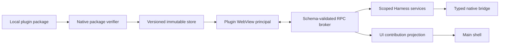

# 阶段 2.4：外部 Harness 插件安全评估

## 结论

当前版本继续只加载随 App 构建发布的可信内置插件，不实现主 WebView 内的第三方 JavaScript 动态加载。

外部 Harness 插件的目标架构确定为“经过完整性校验的本地包 + 独立 Tauri WebView principal + 零默认 native capability + Host 管理的窄 RPC”。在独立 WebView、权限文件、安装回滚和跨 WebView 生命周期都完成前，安装入口保持关闭。

这不是分发格式问题，而是权限边界问题。当前 `main` WebView 可以调用 Harness 注册的 IPC；如果用 `dynamic import()`、`eval()`、React component 注入或同 principal 的 iframe 加载第三方代码，它就继承主界面的能力，`PluginInstanceContext` 的 TypeScript 接口无法形成安全边界。

Tauri v2 的 runtime authority 会按 origin、window/WebView label 和 capability 判断 IPC；同一 WebView 命中多个 capability 时权限会合并。官方文档同时提示，Linux 和 Android 不能可靠区分嵌入 iframe 与宿主窗口的请求。因此 iframe 只适合作为展示手段，不能作为 Harness 的跨平台权限隔离边界。

参考：

- [Tauri Security](https://v2.tauri.app/security/)
- [Runtime Authority](https://v2.tauri.app/security/runtime-authority/)
- [Capabilities](https://v2.tauri.app/security/capabilities/)
- [Content Security Policy](https://v2.tauri.app/security/csp/)

## 已验证的内核边界

阶段 2.1—2.3 已用三类真实插件验证内置插件 contract：

| 场景 | 验证点 | 现有实现 |
|---|---|---|
| 轨迹 | scope resolution、独立 Tab、shell 解耦 | `conversation.tabs` |
| 临时 Agent | 后台生命周期、child thread、service、运行索引 | `harness.agentRuns`、`plugin_runs` |
| SeaTalk | localhost permission、长期连接状态、外部数据、草稿确认 | `harness.localConnectors`、实例 disposer |

这些 contract 可以继续服务内置插件。外部插件不能直接复用同进程 `activate(ctx)`；它需要由 Host 把同一语义投影为序列化 RPC。

## 拒绝的加载方式

| 方式 | 结论 | 原因 |
|---|---|---|
| npm/Git 安装后 `import()` | 拒绝 | 安装脚本和模块初始化都可执行宿主机代码 |
| 从本地文件 `import()` | 拒绝 | 第三方代码与主 React 应用同 principal，可直接尝试 Harness IPC |
| `eval()` / Blob module | 拒绝 | 仍在主 WebView，且显著扩大 CSP 攻击面 |
| `<iframe sandbox>` | 不作为权限边界 | 平台行为不一致，不能依赖它区分 native IPC principal |
| 仅靠 TypeScript `PluginContext` | 拒绝 | 类型在运行时不限制恶意代码访问全局对象 |

## 目标组件



### Package verifier

安装过程只接受本地文件，不运行 package script：

1. 读取 manifest，限制 manifest 与包的总大小。
2. 校验 plugin id、SemVer、Harness engine、entry 相对路径和 capability 名称。
3. 拒绝绝对路径、`..`、symlink、device file 和未列入 manifest 的可执行入口。
4. 对 manifest 列出的每个文件验证 SHA-256；未来远程分发再增加发布者签名。
5. 复制到临时版本目录，重新校验后原子 rename 到 `~/.codex-harness/plugins/<id>/<version>/`。
6. 同版本内容不同则拒绝覆盖；升级并行安装新版本，切换失败回滚实例的 active version。

### WebView principal

每个外部插件实例使用独立、稳定的 WebView label，例如 `plugin:<instance-id>`。该 label 不匹配当前只授权给 `main` 的 capability，也不获得 `core:default`、dialog 或 Harness 自定义命令。

插件页面使用独立 CSP，默认拒绝网络、外部脚本、文件和 asset protocol。需要网络时不能直接扩大 `connect-src`；插件必须声明 connector capability，由 RPC broker 调用 Host 的受限 service。

外部页面不能取得主窗口 DOM、React context、Tauri `invoke` 或原始 App Server transport。Tab 首版可以先由独立窗口承载；只有确认多 WebView 嵌入在所有目标平台都保持独立 label/capability 后，才把它嵌入主窗口区域。

### RPC broker

RPC 消息必须是有上限、可取消、可审计的 envelope：

```ts
interface PluginRpcRequest {
  protocol: 1
  requestId: string
  instanceId: string
  method: string
  params: unknown
}

interface PluginRpcResponse {
  protocol: 1
  requestId: string
  ok: boolean
  result?: unknown
  error?: { code: string; message: string }
}
```

Host 不能提供 generic native invoke 或 generic App Server request。每个 method 绑定 manifest capability、instance scope 和输入/输出 schema；超时、并发、payload 大小和调用频率均由 Host 限制。消息正文按调用返回，不进入 Harness SQLite 或通用审计日志。

## Manifest v1 草案

```json
{
  "schemaVersion": 1,
  "id": "com.example.monitor",
  "name": "Monitor",
  "description": "Workspace monitor",
  "version": "1.0.0",
  "engine": { "codexHarness": "^0.1.0" },
  "supportedScopes": ["workspace"],
  "entry": "dist/index.html",
  "contributions": {
    "tabs": [{ "id": "monitor", "label": "监控", "order": 50 }]
  },
  "capabilities": [
    { "id": "harness.localConnectors", "connector": "monitoring", "operations": ["read"] },
    { "id": "harness.pluginStorage", "operations": ["read", "write"] }
  ],
  "integrity": {
    "dist/index.html": "sha256-BASE64_DIGEST"
  }
}
```

首版 package 不支持 native binary、Node dependency、postinstall、任意 filesystem、任意 shell、任意 URL 或插件自定义 Tauri command。外部插件提供 service 时，service schema 必须在 manifest 中声明，并由 broker 转发；不能把 JavaScript object 直接注册进主进程 registry。

## 实施门槛

外部插件加载进入开发前，必须同时满足：

- `main` 与 `plugin:*` capability 分离，并有原生测试证明 plugin label 无法调用 Harness IPC。
- package verifier 覆盖 traversal、symlink、hash mismatch、同版本覆盖和原子回滚测试。
- RPC broker 覆盖 schema、scope、权限、超时、取消、限流和卸载后请求测试。
- 外部 WebView 使用非空 CSP；主 App 也从当前 `csp: null` 迁到受限 CSP。
- 崩溃、禁用、删除、升级和 App 退出都能关闭 WebView 并撤销 pending RPC。
- 至少用一个只读 Tab 插件和一个 localhost connector 插件做端到端验收。

在这些门槛完成前，`src/plugins/` 仍是唯一插件定义来源。开发新能力时优先实现内置 Harness 插件，等真实需求稳定后再增加外部分发面。
